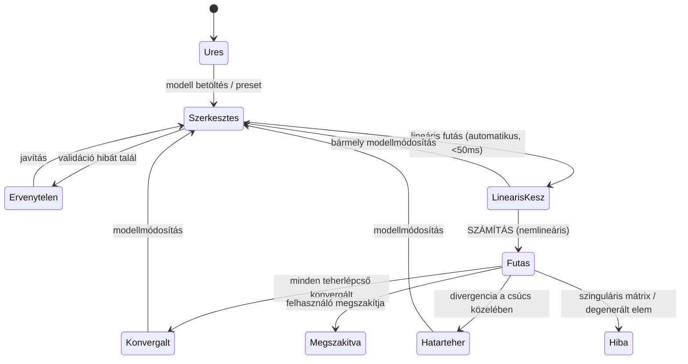

# FEMAti — DESIGN TERV
## Rugalmas–képlékeny Timoshenko gerenda végeselemes analízis — felülettervezési szerződés

**Forrás-design:** `design/FEMAti-A-Klasszikus-CAE-munkaasztal.dc.html` (a megvalósítandó variáns)
**Kiegészítő forrásanyag:** `design/FEMAti-B-*.dc.html`, `design/FEMAti-C-*.dc.html` — tartalmi ötletbányaként, megjelenésükben NEM megvalósítandó
**Kapcsolódó dokumentum:** [MASTER-PROMPT-TERV.md](MASTER-PROMPT-TERV.md) — a mechanikai és architekturális szerződés
**Verzió:** 1.0 — 2026-08-20
**Státusz:** a P7 (UI váz) fázis kötelező bemenete. Ami itt le van fektetve, azt a későbbi fázisok nem írhatják felül ad hoc módon — módosítás csak e dokumentum frissítésével.

---

## 0. MIÉRT KÜLÖN DOKUMENTUM

Ez nem weblap. Egy statikai program felülete **maga is mérnöki eszköz**: a színkódnak mechanikai jelentése van, a számok formátuma szakmai konvenció, a rajzjelek szabványosak, és egy félreolvasható ábra téves méretezéshez vezet. Ezért a felület szabályait ugyanolyan szigorúan kell rögzíteni, mint a merevségi mátrix képletét — és ugyanúgy a kód írása **előtt**.

### A hatókör: kizárólag az „A" variáns

**Döntés (2026-08-20):** a termék az **A — Klasszikus CAE munkaasztal**. Egyetlen téma, egyetlen elrendezés.

**Paletta-csere (2026-08-23):** a felhasználó egy külön elkészült "FEMAti
Landing" marketing-oldal designjából kért teljes átvételt ("teljes sötét
reskin") — a korábbi **A (meleg, világos)** paletta helyett most a **B —
Sötét CAE-munkaasztal** van érvényben (sötét alap, türkiz akcentus, arany
elsődleges gomb, Playfair Display cím-tipográfia). Ld. 2.1/2.3. Az elrendezés
és a klasszikus CAE-koncepció (A/D pont) VÁLTOZATLAN — csak a szín- és
betűtípus-tokenek cserélődtek.

A `design/` mappában lévő B (sötét viewport) és C (vezetett munkafolyamat) variáns **nem része az 1.0-nak**. Nem alternatíva, nem opció, nem „később bekapcsolható mód" — a további tervezés nem számol velük.

Ennek két gyakorlati következménye van, és mindkettő egyszerűsít:

1. **A token-réteg egyetlen palettát tartalmaz.** Nincs téma-váltó, nincs `prefers-color-scheme` ág, nincs duplán karbantartott színkészlet. A tokenek attól még tokenek maradnak — nem hex-értékek szóródnak a komponensekben —, mert az érték egy helyen tartása akkor is helyes, ha csak egy készlet van belőle.
2. **A komponensek fixen erre a sűrűségre és kontrasztra hangolhatók.** Nem kell olyan méretezést választani, ami sötét háttéren is működik; a kontrasztarányok egyetlen háttérhez optimalizálhatók.

A B és C variáns megmarad a `design/` mappában forrásanyagként — a bennük lévő jó megoldásokat (a B határteher-ellenőrző panelje, a C jegyzőkönyv-tipográfiája) **tartalmilag** átemeljük az A elrendezésébe, ahol azok a helyükön vannak. Ez tartalmi átvétel, nem témázás.

---

## 1. DESIGNELVEK

1. **Az adat a főszereplő, nem a keret.** Minden képpont, ami nem szám, ábra vagy vezérlő, indoklásra szorul. Nincs dekoratív illusztráció, nincs hero-szekció, nincs animált átmenet öncélúan.
2. **A szám mindig monospace.** Mérnöki érték proporcionális betűvel nem jelenik meg — a tizedespontnak oszlopban kell állnia.
3. **A mértékegység soha nem hiányzik.** Minden számérték mellett ott a mértékegysége, a diplomaterv 3. táblázata szerint.
4. **A szín jelentést hordoz, de soha nem egyedül.** Minden színkódolt állapotnak van szöveges vagy mintázatos párja is (színtévesztés, nyomtatás).
5. **A bizonytalanság látszik.** Hibabecslő, konvergencia-státusz, „a katalógusadattól eltér" megjegyzés — ezek nem elrejtendő részletek, hanem a szoftver hitelességének bizonyítékai.
6. **Egy képernyő, nem varázsló.** Az A elrendezésben minden lényeges egyszerre látszik; a görgetés a panelen belül van, nem az oldalon.
7. **A felület nem számol.** Minden mennyiség a `fem-core`-ból jön. A UI nem kerekít el jelentést, nem interpolál, nem „szépít".

---

## 2. DESIGN TOKENEK

A tokenek CSS egyéni tulajdonságokként élnek a `:root`-on. Egyetlen készlet, felülírás nélkül. **A komponensek soha nem írnak be nyers hex-értéket** — nem a témázhatóság miatt, hanem mert egy szín jelentése egy helyen legyen definiálva.

### 2.1 Színrendszer — az egyetlen paletta

```css
/* Felületek */
--surface-app:        #0d1014;  /* alkalmazás-háttér */
--surface-chrome:     #11151a;  /* fejléc (menüsor) */
--surface-toolbar:    #11151a;  /* eszközsor */
--surface-panel:      #11151a;  /* oldalpanelek */
--surface-canvas:     #0d1014;  /* modellvászon */
--surface-canvas-bar: #11151a;  /* vászon fejléce */
--surface-raised:     #161b21;  /* beviteli mezők, kártyák */
--surface-note:       #161b21;  /* megjegyzés-doboz */
--surface-hover:      #1b2128;

/* Szegélyek — három erősség */
--border-strong:      #2a323a;  /* panelhatár */
--border-medium:      #232a31;  /* beviteli mező */
--border-subtle:      #1e242b;  /* belső elválasztó */
--border-note:        #2a323a;

/* Szöveg */
--text-primary:       #f2f4f6;
--text-secondary:     #c8d0d8;
--text-muted:         #9aa5b0;  /* címkék, egységek */
--text-faint:         #5f6b76;  /* fejléc-alcím */
--text-note:          #9aa5b0;
--text-on-chrome:     #e2e6ea;

/* Akcentus — türkiz (kijelölés, link, aktív állapot) */
--accent:             #4fd6b4;
--accent-hover:       #7fe8cd;
--accent-light:       #8ce4ce;  /* logó, sötét háttéren; halványabb, mint --accent — megkülönbözteti a "folyamatban" (--status-running) és a "konvergált" (--sem-ok, tömör türkiz) állapotot */
--accent-soft:        rgba(79, 214, 180, 0.14);  /* aktív háttér */

/* Elsődleges gomb — arany gradiens (a landing CTA-mintája, az akcentustól
   szándékosan elkülönítve: a türkiz a KIJELÖLÉS jele, az arany a FŐ
   CSELEKVÉS jele) */
--brand-gold-1:       #f3dfa0;
--brand-gold-2:       #c9a961;
--brand-gold-3:       #a3813e;
--brand-gold-border:  #8a6c2f;
--brand-gold-text:    #241a08;
```

**2026-08-23 frissítés — teljes sötét reskin:** a felhasználó egy külön
elkészült "FEMAti Landing" marketing-oldal tervéből kérte a design teljes
átvételét ("teljes sötét reskin", a 3 opció közül a legradikálisabbat
választva a "csak elemek átvétele" és a "csak a landing, nem az app"
helyett). A teljes korábbi meleg/világos paletta (homok-bézs felület,
téglavörös akcentus) sötét/türkiz/arany palettára cserélődött. Új token-
csoport: `--brand-gold-*`, mert a landing CTA-gombja (arany gradiens)
vizuálisan elkülönül az akcentustól (türkiz) — a régi rendszerben egyetlen
`--accent` szolgálta ki mind a kijelölést, mind az elsődleges gombot, az
újban a kettő szerepe szétvált. A `--sem-*` paletta (2.2) a színkulcs
mögöttes LOGIKÁJÁBAN VÁLTOZATLAN (rugalmas/részben-képlékeny/képlékeny
hármas), csak a konkrét árnyalatok igazodtak a sötét alaphoz. A
`DerivationView`/`ReportView` saját, elszigetelt dokumentum-palettája
(`--der-accent`/`--report-accent`) szándékosan VÁLTOZATLAN maradt — a
nyomtatható/exportálható számítási jegyzőkönyv fehér papíron marad, a
munkaasztal témájától függetlenül (ld. 3.2/4.4).

### 2.2 Szemantikus színek — mechanikai jelentéssel

Ezek a színek **mechanikai állapotot jelölnek**, nem hangulatot. A jelentésük kötött: a felület sehol nem használhatja őket dekorációra.

```css
--sem-elastic:        #5c6975;  /* rugalmas zóna */
--sem-elastic-edge:   #3d4854;
--sem-partial:        #ffb84d;  /* részben képlékeny keresztmetszet */
--sem-partial-edge:   #b9791f;
--sem-plastic:        #ff5f56;  /* képlékeny csukló, teljes folyás */
--sem-plastic-edge:   #a3241d;
--sem-load:           #5c9ee0;  /* teherjelek, nyilak — VÁLTOZATLAN */
--sem-support:        #7c8894;  /* támaszjelek */
--sem-deformed:       #4fd6b4;  /* deformált alak — a landing türkiz "beam glow" vonala */
--sem-undeformed:     #2a323a;  /* eredeti alak, szaggatott */
--sem-analytic:       #ff5f56;  /* analitikus referencia (szaggatott) */
--sem-ok:             #4fd6b4;  /* konvergált */
--sem-warn:           #ffb84d;  /* figyelmeztetés, iterációs limit */
--sem-error:          #ff5f56;  /* divergencia, hiba */
```

**2026-08-23:** a hármas jelentés (rugalmas/részben-képlékeny/képlékeny)
és a `--sem-load` (kék) VÁLTOZATLAN — csak az árnyalatok élénkültek a
sötét alapon olvasható kontrasztra, a landing 3D-feszültség-diagramjának
(`barGray`/`barOrange`/`barRed` gradiensei) színvilágát követve.

**Szemantikai szótár — ezt a táblázatot a felület jelmagyarázata szó szerint követi:**

| Szín | Mechanikai jelentés | Mintázat (színvakság-tartalék) |
|---|---|---|
| Szürke-kék `--sem-elastic` | Minden Gauss-pont rugalmas | tömör kitöltés |
| Borostyán `--sem-partial` | Néhány, de nem minden réteg megfolyt | 45°-os vonalkázás |
| Vörös `--sem-plastic` | A keresztmetszet teljes egészében képlékeny | sűrű keresztvonalkázás |

### 2.3 Tipográfia

```css
--font-ui:    'IBM Plex Sans', system-ui, -apple-system, sans-serif;
--font-mono:  'JetBrains Mono', ui-monospace, 'SFMono-Regular', monospace;
--font-serif: 'Playfair Display', Georgia, serif;   /* cím-tipográfia (landing hero-stílus) */
```

**2026-08-23 frissítés — teljes sötét reskin:** a betűtípus-hármas a
landing designból került át. `--font-ui` a korábbi `Space Grotesk`-ről
visszaváltott tiszta `IBM Plex Sans`-ra (a landing testszövege is ez).
`--font-mono` `IBM Plex Mono`-ról `JetBrains Mono`-ra cserélt — ez adja a
landing technikai/kód-jellegű feliratainak (pl. a `q = 40.00 kN/m`
teherfelirat, a fejléc breadcrumb) karakterét, és innentől EZ a
munkaasztal egyetlen monospace betűtípusa is, a mérnöki szám-igazítás
szerepét megtartva. `--font-serif` `Source Serif 4`-ről `Playfair
Display`-re váltott.

**2026-08-23, még ugyanaznap:** a felhasználó kifejezetten kérte, hogy a
`Playfair Display` kapjon élő felhasználási helyet a munkaasztalon — a
`.vem-chrome__headline` egy középre igazított, `aria-hidden` díszítő
felirat lett a fejlécben ("Rugalmas–képlékeny Timoshenko-gerenda
végeselemes analízis"), a korábbi bal-igazított `.vem-chrome__subtitle`
helyett. Ez SZÁNDÉKOS, dokumentált kivétel az 1. fejezet "nincs dekoratív
illusztráció, nincs hero-szekció... öncélúan" elve alól — közvetlen,
konkrét felhasználói kérésre, nem tervezői döntésből. 900px alatt eltűnik
(nem üti a menüsort/fájlnevet szűk viewporton).

| Szerep | Méret / vastagság / betűköz | Használat |
|---|---|---|
| `--type-label` | 10.5px / 600 / +0.09em / UPPERCASE | Panelfejléc: „MODELLFA", „EREDMÉNYEK" |
| `--type-field-label` | 10.5px / 500 | Vezérlő fölötti címke: „Fesztáv L [m]" |
| `--type-body` | 13px / 400 | Alapszöveg |
| `--type-body-sm` | 11.5px / 400 | Jelmagyarázat, megjegyzés |
| `--type-value` | 13px / 500 mono | Eredménytábla számértéke |
| `--type-value-lg` | 15px / 600 mono | Eszközsor kiemelt értéke (L = 12.0) |
| `--type-value-xl` | 22px / 700 mono | Kiemelt mérőszám (határteher, λu) |
| `--type-unit` | 11px / 500 mono, `--text-muted` | Mértékegység a szám után |
| `--type-title` | 14px / 600 | Alkalmazásnév |

**Szabály:** minden szám `--font-mono`, `font-variant-numeric: tabular-nums`. Kivétel nincs.

### 2.4 Térköz, méret, forma

```css
--space-1: 3px;  --space-2: 5px;  --space-3: 7px;  --space-4: 9px;
--space-5: 12px; --space-6: 14px; --space-7: 18px; --space-8: 22px;

--radius-sm: 2px;    /* gombok, mezők — szögletes, mérnöki */
--radius-md: 3px;    /* menü, kártya */
--radius-pill: 999px;/* státusz-pötty */

--h-chrome:  38px;   /* fejléc magassága */
--h-control: 28px;   /* gomb, select alapmagasság */
--w-panel-left:  266px;
--w-panel-right: 272px;
--w-panel-min:   222px;

--shadow-menu: 0 12px 28px rgba(0,0,0,.4);
--shadow-card: 0 1px 2px rgba(0,0,0,.06);
```

**Forma-elv:** kis sugarak (2–3px). A lekerekített, „barátságos" felület itt hiteltelen — a CAE-eszközök szögletesek, mert a pontosságot sugallják.

### 2.5 Mozgás

| Mi | Időtartam | Megjegyzés |
|---|---|---|
| Hover, fókusz | 90 ms | `ease-out` |
| Panel nyitás/zárás | 160 ms | |
| Számítás-pörgettyű | 800 ms lineáris, végtelen | Csak futás alatt |
| Teherlépcső-animáció | felhasználó vezérli | **Nem** automatikus; a sebesség állítható |
| Diagram-átrajzolás | 0 ms | **Nincs átmenet.** A számérték-változás azonnali; az animált diagram félrevezető |

`prefers-reduced-motion: reduce` esetén a pörgettyű statikus jelzésre vált, az animációk kikapcsolnak.

---

## 3. ELRENDEZÉS-ARCHITEKTÚRA

### 3.1 Az alkalmazás váza

```
┌─────────────────────────────────────────────────────────────────────────┐
│ CHROME  38px                                                             │
│ [V] FEMAti  alcím │ Fájl Szerkesztés Nézet Számítás Elmélet Súgó │  … ● konvergált │
├─────────────────────────────────────────────────────────────────────────┤
│ TOOLBAR  (flex-wrap, cellákra osztva, cellánként vezérlő + UPPERCASE címke) │
│ ┌Szerkezet─┐┌Geometria─┐┌Szelvény·anyag┐┌Háló──┐┌Integrálás┐┌Tehertörténet┐ … [SZÁMÍTÁS][Jegyzőkönyv] │
├──────────┬──────────────────────────────────────────┬───────────────────┤
│ LEFT     │ CANVAS                                   │ RIGHT             │
│ 266px    │ flex: 1 1 460px, min 380px               │ 272px             │
│          │ ┌ vászon-fejléc: cím + jelmagyarázat ──┐ │                   │
│ Modellfa │ │                                      │ │ Eredmények        │
│          │ │   modellrajz + deformáció            │ │ Reakciók          │
│ Kereszt- │ │                                      │ │ Egyensúly         │
│ metszet  │ ├──────────────────────────────────────┤ │ Határteher-       │
│          │ │  DIAGRAM-SÁV  [M][T][w][φ][P-δ][konv]│ │ ellenőrzés        │
│ Megoldó  │ └──────────────────────────────────────┘ │ Hálófüggetlenség  │
├──────────┴──────────────────────────────────────────┴───────────────────┤
│ TIMELINE  ◀ ▮▮▮▮▮▯▯▯ ▶  λ = 0.72   ▶ lejátszás   (csak nemlineáris futás után) │
└─────────────────────────────────────────────────────────────────────────┘
```

### 3.2 Panelszabályok

- Minden panel **saját görgetéssel** rendelkezik (`overflow: auto`), az oldal maga **soha nem görög függőlegesen**.
- A panelfejléc `position: sticky; top: 0` — görgetéskor is látszik, melyik szekcióban vagyunk.
- Panelen belüli szekciók `--border-subtle` vonallal válnak el, nem térközzel.
- A bal és jobb panel **összecsukható** (a Nézet menüből és `Ctrl+1` / `Ctrl+3`). Összecsukva 0 px, a vászon kitölti a helyet — ez a B téma „viewport" élménye.

### 3.3 Töréspontok

| Szélesség | Viselkedés |
|---|---|
| ≥ 1440px | Teljes elrendezés, minden panel nyitva |
| 1100–1439px | A jobb panel fölé kerül a diagram-sáv; a toolbar két sorba tördel |
| 768–1099px | A bal panel alapból összecsukott, fülről nyitható |
| < 768px | **Egy oszlop, fülekkel:** Modell / Vászon / Eredmény. A modellszerkesztés korlátozott — figyelmeztetés, hogy a pontos munkához nagyobb képernyő ajánlott |

A vászon SVG `viewBox`-a fix (1200×420 arány), `preserveAspectRatio="xMidYMid meet"` — a rajz sosem torzul.

**2026-08-23 frissítés:** a `< 768px` sor 2026-08-20 óta le volt írva, de nem
készült el — a felhasználó jelezte, hogy a bal/jobb panel a tényleges kódban
csak eltűnt, visszanyitás nélkül. Pótolva: `appStore.ts` `mobileTab`
állapota + a fejezet-fülsáv (`App.tsx`, `shell.css` `.vem-mobile-tabs`).

---

## 4. KOMPONENS-INVENTÁR

### 4.1 Atomok

| Komponens | Leírás | Kulcs-állapotok |
|---|---|---|
| `Button` | `variant`: `primary` \| `secondary` \| `ghost`, `size`: `md` \| `sm` | hover, active, **disabled**, **loading** (pörgettyűvel) |
| `SegmentedControl` | Kizáró választás (szelektív/teljes, monoton/tehermentesítés, Newton/mód. Newton) | aktív szegmens `--accent` háttérrel |
| `Slider` | Címke + `input[type=range]` + monospace érték jobbra | fókusz-gyűrű, lépésköz kiírva |
| `Select` | Natív `<select>`, tokenizált kerettel | |
| `Checkbox` | Címkével egy sorban | |
| `ValueDisplay` | **szám + mértékegység** pár; `emphasis`: `normal` \| `large` \| `hero` | `tone`: `neutral` \| `warn` \| `error` |
| `StatusPill` | Pötty + szöveg | `state`: `idle` \| `running` \| `converged` \| `limit-load` \| `diverged` \| `error` |
| `SectionLabel` | UPPERCASE panelfejléc | sticky |
| `NoteBox` | Magyarázó doboz `--surface-note` háttérrel | `tone`: `info` \| `warn` |
| `Legend` | Jelmagyarázat: színminta + mintázat + szöveg | |
| `Logo` | Márkajel (csomóponti-V) — `variant`: `mark` (fejléc/favicon) \| `full` (BME · 1996 plakettel) | `theme`: `dark` \| `light` |

### 4.2 Molekulák

| Komponens | Tartalom |
|---|---|
| `ToolbarCell` | Vezérlő(k) + UPPERCASE alcímke, jobb oldali elválasztó vonallal |
| `MenuBar` | Menüsáv legördülőkkel, kattintásra nyíló, kívülre kattintva záródó, `Esc`-re záródó |
| `ModelTree` | Fa: elem + érték jobbra igazítva monospace-ben. Kattintásra a kapcsolódó panelre ugrik |
| `SupportsList` / `LoadsList` | Támaszok/terhek külön, ikonos (`SupportIcon`/`LoadIcon`, `panels/icons.tsx`) itemlistája — soronként kattintható, kiválasztja a modellt |
| `SupportToolsPanel` / `LoadToolsPanel` | 2 lebegő panel a vászon fölött (bal/jobb felül) — ÚJ támasz/teher elhelyezésének eszközei, ugyanazokkal az ikonokkal |
| `SectionPreview` | Keresztmetszet SVG + A, I, Mₑ, Mₚ, c értékek |
| `ResultRow` | Címke balra, érték + egység jobbra. **Ez az alap eredmény-primitív** |
| `ResultTable` | `ResultRow`-k listája szekciócímmel |
| `ComparisonRow` | Analitikus / végeselem / eltérés hármas — a validációs esetekhez |
| `ConvergenceChart` | Reziduum log-skálán, lépésekre bontva |
| `LoadDisplacementChart` | P–δ görbe, rugalmas egyenessel és határteher-aszimptotával |
| `DiagramChart` | M / T / w / φ ábra, közös x-tengellyel és összehangolt hoverrel |
| `Beam3DStress` | Izometrikus, extrudált szélső-szál σ=M·z/I — sematikus geometria, ld. [ADR-0015](docs/ADR/0015-3d-feszultseg-vizualizacio.md) |
| `SectionInspector` | Rétegenkénti σ-profil + M–κ görbe + semleges tengely (a P13 fő komponense) |
| `StepTimeline` | Teherlépcső-csúszka, lejátszás, kulcsesemény-jelölők (első folyás, csukló kialakulása) |

### 4.3 Panelek

`ModelTreePanel`, `SectionPanel`, `SolverPanel`, `CanvasPanel`, `DiagramPanel`, `ResultsPanel`, `ReactionsPanel`, `LimitLoadPanel`, `MeshStudyPanel`, `ReportView`, `DerivationView`.

### 4.4 A Levezetés nézet

Külön, teljes képernyős nézet (nem panel), amely a számítás **teljes menetét**
mutatja be, és `.docx` / `.pdf` formátumban kimenthető. Részletes tartalmi
előírása a MASTER-PROMPT-TERV **P15/A** promptjában, az elvi döntés az
[ADR-0005](docs/ADR/0005-levezetes-ujraszamolassal.md)-ben.

Megjelenési szabályok:

| Elem | Szabály |
|---|---|
| Címek | `--font-serif` (Source Serif 4) — a jegyzőkönyv tipográfiája elkülönül a munkaasztaltól |
| Képletek | monospace, Unicode matematikai jelekkel; **nem kép**, hogy a `.docx`-ben szerkeszthető és kereshető maradjon |
| Behelyettesítés | minden képlet alatt a számokkal kitöltött alak, majd az eredmény — MathCAD-lap logika |
| Mátrixok | monospace rács, tizedespont-igazítással; a 6×6 Kₑ teljes egészében kiírva |
| Elemválasztó | a fejlécben: melyik elem és melyik Gauss-pont levezetése látszik |
| Hivatkozás | minden képlet mellett a diplomaterv egyenletszáma (pl. „(3.14)") |
| Nyomtatás | `@media print`: A4, ismétlődő fejléc, oldalszám, a lábléc figyelmeztetésével |

**Kötelező jelzés a nézet tetején:** a levezetés ugyanazokat a függvényeket
futtatja, mint a megoldó — nem egy párhuzamos, kézzel átírt számítás. Ezt a
P15/A bit-azonossági tesztje garantálja, és a nézet ki is írja, melyik
futás eredményét mutatja (modell, dátum, verzió).

---

## 5. A MODELLVÁSZON RAJZOLÁSI SPECIFIKÁCIÓJA

> Ez a rész az, amiért ez a dokumentum létezik. Egy CAE-vászon szabályai nem esztétikai kérdések.

### 5.1 Koordináta-rendszer

- Modelltér: `x` [m] jobbra, `z` [m] **lefelé** pozitív (a diplomaterv 3-1. ábrája).
- Képernyőtér: SVG `viewBox="0 0 1200 420"`, a tartó a `[76, 1124]` x-sávban, a tengelye `y = 240`-nél.
- A transzformáció **egyetlen helyen** él (`useModelTransform`): `sx = 76 + (x/L)·1048`.
- **A deformáció léptéke független és mindig ki van írva** („deformáció ×4317"). Automatikus lépték: a legnagyobb elmozdulás a rajzon 60 px legyen; kézzel felülírható.

### 5.2 Rétegsorrend (alulról felfelé)

1. Rács (halvány, csak sötét témában)
2. Eredeti (terheletlen) tengely — szaggatott, `--sem-undeformed`
3. Elemhatárok és csomópontok
4. **Képlékeny zóna sáv** — az elem magassága mentén színezve
5. Deformált alak — tömör, `--sem-deformed`, 2px
6. Támaszjelek
7. Teherjelek
8. Képlékeny csuklók
9. Feliratok, kóták

### 5.3 Rajzjelek (magyar építőmérnöki konvenció)

| Elem | Jel |
|---|---|
| Csuklós/görgős támasz | Háromszög, csúcsával a csomópontra; görgősnél alatta vízszintes vonal + két kör |
| Befogás | Tömör téglalap + 45°-os sraffozás a tartón kívül |
| Rugós támasz | Cikkcakk vonal, mellette `k = … kN/m` |
| Koncentrált erő | Lefelé mutató nyíl, hossza konstans (nem arányos), mellette `P = … kN` |
| Koncentrált nyomaték | Ívelt nyíl |
| Megoszló teher | Vízszintes fedővonal + egyenletesen elosztott nyilak (max. 24 db, sűrűbbnél ritkítva) + `q = … kN/m` |
| Trapéz teher | A fedővonal ferde, a nyilak hossza arányos |
| Hőteher | Az elem fölött-alatt hőmérséklet-felirat, közte gradiens-sáv |
| Csomópont | 3px kör; a középső csomópont üres, a szélső tömör |
| Képlékeny csukló | Üres kör `--sem-plastic` kerettel, 6px, a tengelyen |
| Gauss-pont (bekapcsolható) | 2px × jel |

### 5.4 Diagramok

- **Nyomatéki ábra a húzott oldalra** rajzolódik (magyar konvenció). A `Nézet` menüből átkapcsolható, de az alapértelmezés ez, és a diagram sarkában mindig ott a jelzés: `M ▼ húzott oldal`.
- A diagram alapvonala a tartó tengelye; a kitöltés félig áttetsző, a kontúr tömör.
- **Minden diagramon:** a szélsőérték számértéke + helye kiírva; a nulla-átmenetek megjelölve.
- A négy ábra (M, T, w, φ) **közös x-tengelyen**, összehangolt hoverrel: egy metszeten állva mind a négy érték egyszerre olvasható le.
- Az analitikus referencia (ahol van) szaggatott `--sem-analytic` vonal, külön jelmagyarázattal.

### 5.5 Üres és hibaállapot

| Állapot | Mit mutat a vászon |
|---|---|
| Nincs modell | Halvány gerendaváz-ábra + „Válassz statikai vázat vagy rajzolj újat" |
| Érvénytelen modell | A hibás entitás pirosan kiemelve a rajzon **és** a modellfában, a diagnosztika szövegével |
| Számítás fut | A rajz megmarad, halványítva; pörgettyű + „iteráció 3 / lépés 7" |
| Divergencia a határterhelésnél | Az utolsó konvergált állapot marad kirajzolva, `--sem-warn` kerettel + „határteher elérve, λu = 1.647" — **ez nem hibaüzenet, hanem eredmény** |

---

## 6. MÉRNÖKI MEGJELENÍTÉSI SZABÁLYOK

### 6.1 Számformázás

| Mennyiség | Egység | Tizedesek | Példa |
|---|---|---|---|
| Lehajlás w | mm | 3 | `13.434 mm` |
| Elfordulás φ | rad (×10⁻³) | 3 | `8.235 ×10⁻³ rad` |
| Nyomaték M | kNm | 2 | `132.50 kNm` |
| Nyíróerő T | kN | 2 | `112.32 kN` |
| Hajlítómerevség EI | kNm² | 0 | `16790 kNm²` |
| Nyírási merevség GAs | kN | 0 | `172038 kN` |
| Terület A | cm² | 2 | `51.88 cm²` |
| Inercia I | cm⁴ | 0 | `7995 cm⁴` |
| Feszültség σ | kN/cm² | 2 | `23.50 kN/cm²` |
| Teherszorzó λ | – | 3 | `1.647` |
| Eltérés, hiba | % | 2 | `6.14 %` |

Szabályok:
- **Nincs ezres elválasztó** a monospace oszlopokban (a tizedespont igazítása fontosabb).
- Zérus mindig `0`, nem `0.000` — kivéve táblázatoszlopban, ahol az igazítás számít.
- Nem véges érték (`NaN`, `∞`) helyén `—`, soha nem `NaN`.
- Az érték és az egység **külön elem**: az érték `--text-primary`, az egység `--text-muted`. Így az egység nem versenyez a számmal.

### 6.2 Toleranciák megjelenítése

Ahol analitikus referencia létezik, a felület **mindig hármat mutat**: referencia, számított, eltérés. Az eltérés színkódolt:

| Eltérés | Szín | Jelentés |
|---|---|---|
| ≤ a validációs tűrés | `--sem-ok` | rendben |
| a tűrés 1–3-szorosa | `--sem-warn` | gyanús, hálósűrítés javasolt |
| > a tűrés háromszorosa | `--sem-error` | az eredmény nem megbízható |

### 6.3 Ami soha nem jelenhet meg

- Számérték mértékegység nélkül.
- Eredmény anélkül, hogy látszana: konvergált-e.
- „Sikeres" visszajelzés olyan futásra, amely elérte az iterációs limitet.
- Kerekített érték, amely a nem-konvergencia tényét elfedi.

---

## 7. INTERAKCIÓS MODELL

### 7.1 Állapotgép



**Kulcsszabály:** a modell bármely módosítása azonnal érvényteleníti a nemlineáris eredményt. Az elavult eredmény nem maradhat a képernyőn — a panelek halványodnak és megjelenik: „a modell módosult, futtasd újra".

### 7.2 Interakciók

| # | Interakció | Válaszidő |
|---|---|---|
| 1 | Preset választása | azonnal + lineáris futás |
| 2 | Fesztáv / elemszám / rétegszám csúszka | élő, húzás közben újraszámol (lineáris) |
| 3 | Szelvény / anyag választás | azonnal |
| 4 | Integrálás váltása (szelektív ↔ teljes) | azonnal — **a záródás hatása élőben látszik** |
| 5 | Támasz áthúzása a vásznon | húzás közben előnézet, elengedéskor számítás |
| 6 | Teher rajzolása húzással | ugyanaz |
| 7 | Gauss-pontra kattintás | keresztmetszet-inspektor nyílik |
| 8 | Teherlépcső-idővonal léptetése | < 16 ms (előre kiszámított állapotok) |
| 9 | Diagram hover | < 16 ms, mind a négy ábrán egyszerre |
| 10 | SZÁMÍTÁS | Web Workerben, haladásjelzéssel, megszakíthatóan |

### 7.3 Billentyűparancsok

| Billentyű | Művelet |
|---|---|
| `F5` / `Ctrl+Enter` | Számítás |
| `Esc` | Menü zárása / futás megszakítása |
| `Ctrl+1` / `Ctrl+3` | Bal / jobb panel ki-be |
| `Ctrl+S` | Modell letöltése |
| `Ctrl+P` | Jegyzőkönyv |
| `←` / `→` | Teherlépcső léptetése |
| `Space` | Lejátszás / szünet |
| `Ctrl+0` | Nézet visszaállítása |
| `?` | Billentyűparancsok súgója |

---

## 8. A FELÜLET ↔ MAG ADATSZERZŐDÉS

A `design/vem-core.js` prototípus már rögzíti, milyen adatokat vár a felület. A valódi `fem-core`-nak ezt kell kiszolgálnia — **ez a szerződés köti a P4–P13 fázisokat**.

```ts
interface LinearResult {
  u: Float64Array;                    // csomóponti elmozdulások [w, φ] párokban
  fields: { x: number[]; w: number[]; phi: number[]; M: number[]; T: number[] };
  reactions: { nodeId: string; x: number; Fz: number; My: number }[];
  extremes: { wMax: Value; phiMax: Value; MMax: Value; TMax: Value };
  props: { EI: number; GAs: number; A: number; I: number; Me: number; Mp: number; c: number };
  dofCount: number;
  errorEstimate: number;              // egyensúlyi maradék [%]
  equilibrium: { sumFz: number; sumMy: number };  // ellenőrző összegek
}

interface NonlinearResult {
  steps: LoadStep[];                  // teherlépcsőnkénti pillanatképek
  lambdaUltimate: number | null;      // elért határteherszorzó
  status: 'converged' | 'limit-load' | 'diverged' | 'aborted';
  iterationLog: { step: number; iter: number; residual: number }[];
  yieldedGaussPoints: { current: number; total: number };
  plasticHinges: { x: number; step: number }[];
  residualStress: { equilibriumDefect: number; maxResidual: number };
}

interface LoadStep {
  lambda: number;
  u: Float64Array;
  fields: LinearResult['fields'];
  elementState: ('elastic' | 'partial' | 'plastic')[];
  gaussPoints: { elementId: string; xi: number; layers: Float64Array }[]; // rétegenkénti σ
}

interface AnalyticReference {          // a validációs panelekhez
  label: string;                       // pl. "qu = 16·Mp/L²"
  value: number;
  unit: string;
}
```

**Következmény a P4–P6 fázisokra:** a lineáris megoldónak már most vissza kell adnia az `equilibrium`, `errorEstimate` és `props` mezőket, mert a felület ezekre épül. Ezt a MASTER-PROMPT-TERV P4 és P6 promptjához hozzá kell venni.

---

## 9. AKADÁLYMENTESSÉG

1. **Kontraszt:** minden szöveg ≥ 4.5:1, a nagy számok ≥ 3:1. A `--text-faint` csak nem-lényegi információra (≥ 3:1 biztosított).
2. **Fókusz:** minden interaktív elem 2px `--accent` fókuszgyűrűvel, `:focus-visible`-lel. A vászon entitásai `tabindex`-szel bejárhatók.
3. **Szín nélkül is olvasható:** a képlékeny állapotokat mintázat is jelöli; a diagramokon a vonaltípus (tömör/szaggatott/pontozott) is megkülönböztet.
4. **A vászon szöveges alternatívája:** `aria-label` a teljes modellről („Kétnyílású folytatólagos gerenda, 12 m, 3 támasz, egyenletes teher 30 kN/m"), és az eredmények táblázatos formában is elérhetők — a táblázat a képernyőolvasó elsődleges útja.
5. **Élő régió:** a státusz (`StatusPill`) `aria-live="polite"`; a hibák `aria-live="assertive"`.
6. **Nyelv:** `lang="hu"`; a mértékegységek `<abbr>`-ben teljes névvel.

---

## 10. IMPLEMENTÁCIÓS LEKÉPEZÉS

```
packages/ui/src/
├─ design/
│  ├─ tokens.css          ← a 2. fejezet tokenjei (egyetlen paletta)
│  ├─ reset.css
│  └─ typography.css
├─ components/
│  ├─ Button.tsx  SegmentedControl.tsx  Slider.tsx  Select.tsx
│  ├─ ValueDisplay.tsx  StatusPill.tsx  SectionLabel.tsx
│  ├─ NoteBox.tsx  Legend.tsx  ResultRow.tsx  ResultTable.tsx
│  └─ ComparisonRow.tsx
├─ canvas/
│  ├─ useModelTransform.ts     ← az EGYETLEN koordináta-transzformáció
│  ├─ ModelCanvas.tsx
│  ├─ marks/  Support.tsx  Load.tsx  Node.tsx  PlasticHinge.tsx
│  └─ layers/ Undeformed.tsx  PlasticZone.tsx  Deformed.tsx
├─ charts/
│  ├─ useSharedXAxis.ts        ← összehangolt hover
│  ├─ DiagramChart.tsx  LoadDisplacementChart.tsx  ConvergenceChart.tsx
│  └─ SectionStressChart.tsx
├─ panels/  … (4.3 szerint)
├─ shell/   AppShell.tsx  MenuBar.tsx  Toolbar.tsx  Timeline.tsx
├─ state/   modelStore.ts  resultStore.ts  uiStore.ts
├─ format/  numbers.ts          ← a 6.1 formázási szabályok EGY helyen
└─ i18n/    hu.ts  en.ts
```

**Három szabály, amit a kódnak ki kell kényszerítenie:**

1. `format/numbers.ts` az egyetlen hely, ahol szám szöveggé alakul. A komponensek nem hívnak `toFixed`-et.
2. `canvas/useModelTransform.ts` az egyetlen hely, ahol modelltér → képernyőtér átváltás történik.
3. A komponensek nem tartalmaznak hex-színt; ESLint szabály tiltja a `#rrggbb` mintát a `components/`, `canvas/`, `charts/` alatt.

---

## 11. AMIT NEM CSINÁLUNK

- Nincs onboarding-túra, nincs felugró tipp, nincs „tudtad-e".
- Nincs animált átmenet számértékek között.
- Nincs mobil-első elrendezés: ez asztali mérnöki eszköz, a mobil nézet olvasásra való.
- Nincs testreszabható panel-elrendezés (drag-and-drop dokkolás) az 1.0-ban — a rögzített elrendezés kiszámíthatóbb.
- Nincs felhasználói fiók, felhő-mentés, megosztás. A modell egy fájl.
- **Nincs témaváltás.** Egy paletta van (B variáns, 2026-08-23-tól). Sötét mód/világos mód kapcsoló, `prefers-color-scheme` ág nem készül — a paletta maga eleve sötét.

---

## 12. A DESIGN-TERV VISZONYA A FÁZISOKHOZ

| Fázis | Mit vesz át innen |
|---|---|
| **P7** | 2. (tokenek), 3. (elrendezés), 4.1–4.2 (atomok, molekulák), 5.1–5.3 (vászon) |
| **P8** | 5.4 (diagramok), 6.1 (számformázás) |
| **P13** | 4.2 `SectionInspector`, `StepTimeline`, 5.2 (képlékeny rétegek), 7.1 (állapotgép) |
| **P15** | A jegyzőkönyv szerif címtipográfiája (`--font-serif`) |
| Mind | 6. (mérnöki szabályok), 9. (akadálymentesség) |

**Változáskezelés:** ha egy fázis során kiderül, hogy egy itt rögzített szabály nem tartható, a szabályt **itt kell módosítani**, indoklással, és a változást a `docs/ADR/` alatt rögzíteni. Ad hoc eltérés a komponensben nem megengedett — pontosan ezt akartuk elkerülni azzal, hogy ez a dokumentum a kód előtt készült el.

---

*Készült a `design/` mappa három canvas-variánsa, kilenc képernyőképe és a `vem-core.js` prototípus alapján.*
