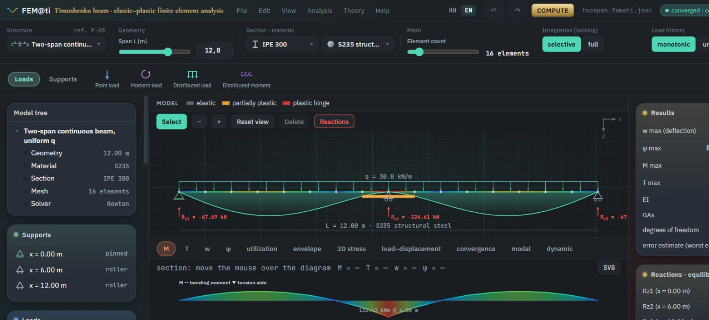
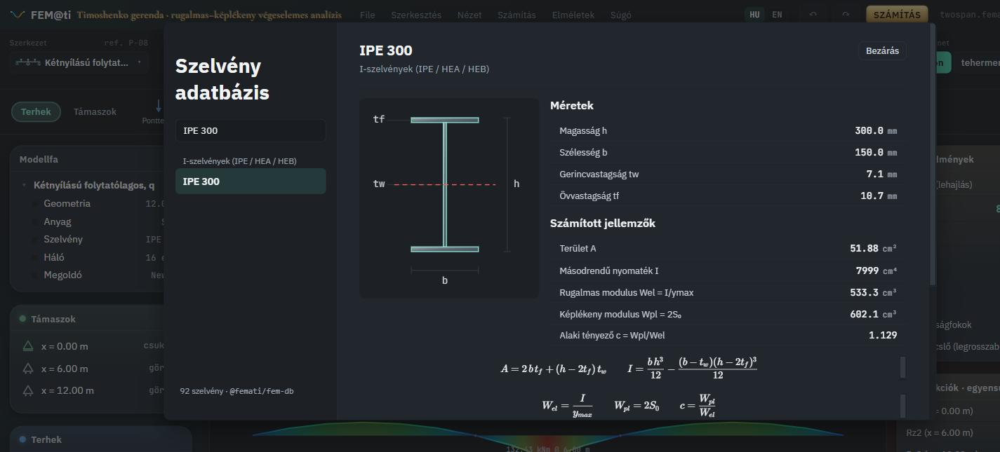

# FEM@ti

*[Magyarul](README.hu.md)*

**Elastic–plastic Timoshenko-beam finite element analysis** — a modern,
TypeScript-based, validated FEA program.

> **Note on language:** the source comments and the deeper documentation
> (`docs/`, ADRs) are in Hungarian — this is a personal project built around
> a Hungarian engineering thesis. This README exists so an English-speaking
> visitor can understand what the project does and judge its engineering/
> software quality without reading Hungarian. The application's own user
> interface has a full HU/EN switch (header, top right, as of 2026-09-05) —
> if you run it, you can work entirely in English; the physics notation
> (M, T, w, φ, E, G, I, A) was always standard and language-independent
> regardless. Catalog data (material/section names and sources) and a few
> secondary chart/diagram panels remain Hungarian-only in both UI languages
> for now.

---

## What is this?

In 1996, a thesis at the Budapest University of Technology (BME) produced an
elastic–plastic Timoshenko-beam finite element program: 3-node quadratic
beam elements, selective reduced integration (against shear locking), a
frontal equation solver, and a layered (fiber) cross-section model to track
plastic deformation.

FEM@ti reimplements the same structural-mechanics model thirty years later,
as a modern, interactive, browser-based application — not "inspired by" the
thesis, but **line-by-line traceable** to it: every implemented formula is
matched to the thesis's exact page and equation number (see
[`docs/THEORY.md`](docs/THEORY.md)), and every mechanical claim is proven by
a validation test against closed-form or hand-calculated reference values
(see [`docs/VALIDATION.md`](docs/VALIDATION.md)). For a direct answer to
"how do you know the underlying mechanics is correct, and what are you
*not* claiming," see [`docs/VALIDATION-SCOPE.md`](docs/VALIDATION-SCOPE.md).

Wherever current software-engineering practice diverges from the 1996
solution (e.g. skyline storage instead of the frontal solver on the
production path), that divergence is recorded in a dedicated architecture
decision record (ADR) — including the ORIGINAL frontal algorithm itself,
which remains available, animated, in the app's "Historical mode" view for
teaching purposes (see [ADR-0002](docs/ADR/0002-skyline-vs-frontalis.md)).

### Why it's worth a look

- **Interactive model canvas** — click/drag-editable beam model (supports,
  point/distributed loads), with live recomputation on every change.
- **Linear AND nonlinear (elastic–plastic) analysis** — Newton–Raphson
  solver with adaptive load stepping, REFORB stress return-mapping, a
  load-step timeline, and plastic-zone visualization.
- **Full, auditable derivation** for every step — per-Gauss-point shape
  function / Jacobian / B-matrix / stiffness-matrix values, layered plastic
  return-mapping, with Word (.docx, real OOXML math objects) and printable
  PDF export.
- **Calculation report** and a **"Historical mode"** (an animated replay of
  the original 1996 frontal algorithm, side by side with today's skyline
  solver).
- **~660 automated tests**, including a 10,000-element fuzz test
  (`fast-check`) proving the solver never throws an unhandled exception and
  always returns an equilibrated result on random structures.

---

## Running it

Prerequisite: **Node.js ≥ 20**, **pnpm 10** (the repo's `packageManager`
field pins the exact version — after `corepack enable` the correct pnpm is
picked up automatically).

```bash
pnpm install
pnpm --filter @femati/ui dev
```

This starts the Vite dev server — open the printed
`http://localhost:5173` URL in a browser.

### Verification (typecheck + lint + test, across all packages)

```bash
pnpm check
```

### Production build

```bash
pnpm build
```

---

## Monorepo layout

pnpm workspace, 4 packages:

| Package | Contents |
|---|---|
| [`packages/fem-core`](packages/fem-core) | The actual FEM core: model, elements, solvers (skyline-LDLᵀ and the historical frontal one), material models, validation, post-processing — **no DOM dependency**, usable standalone. |
| [`packages/fem-db`](packages/fem-db) | Material and cross-section catalog, with source attribution (every record requires a `source`/`verified` field). |
| [`packages/fem-validation`](packages/fem-validation) | The validation cases that GENERATE `docs/VALIDATION.md` (against closed-form/hand-calculated references). |
| [`packages/ui`](packages/ui) | React + Vite client-side UI — computation runs in the browser, no backend. |

See [`docs/architecture.html`](docs/architecture.html) for an interactive
diagram of how these four packages actually depend on each other (open it
in a browser) — including the distinction between what runs live in the
browser and what only runs in dev/CI (`fem-validation`, and `fem-db`'s own
test suite, which checks its catalog data against `fem-core`'s computed
properties).



<sub>The `fem-db` catalog browser (`docs/QUICKSTART.md` walks through it) — every entry ties its computed properties back to the formula that produced them.</sub>

## Documentation

| Document | Contents |
|---|---|
| [`docs/QUICKSTART.md`](docs/QUICKSTART.md) | Quick start — how to carry a model through the workspace (build → load → results → section suggestion), with screenshots. |
| [`docs/THEORY.md`](docs/THEORY.md) | Every implemented formula: code location AND thesis page number. (Hungarian) |
| [`docs/CONVENTIONS.md`](docs/CONVENTIONS.md) | Fixed engineering/coding conventions (sign conventions, DOF order, units). (Hungarian) |
| [`docs/VALIDATION.md`](docs/VALIDATION.md) | Generated validation report. (Hungarian) |
| [`docs/VALIDATION-SCOPE.md`](docs/VALIDATION-SCOPE.md) | What was validated, how, and what is *not* claimed — a summary for reviewers/colleagues. |
| [`docs/HIBATURESI-POLITIKA.md`](docs/HIBATURESI-POLITIKA.md) | Error-handling/risk policy (K1–K8). (Hungarian) |
| [`docs/ADR/`](docs/ADR) | Architecture decision records. (Hungarian) |
| [`MASTER-PROMPT-TERV.md`](MASTER-PROMPT-TERV.md) | The project's full, phase-by-phase plan. (Hungarian) |
| [`STATUS_REPORT.md`](STATUS_REPORT.md) | Continuously updated, phase-by-phase status report. (Hungarian) |

The app's "Elméletek" (Theories) menu exposes the same content directly in
the application, typeset with KaTeX.

## License

[MIT](LICENSE)

---

*Built on a full read-through of the original `Diplomaterv (BME).pdf`
(73 pages) — every mechanical formula comes from a verified source, none
was invented.*
