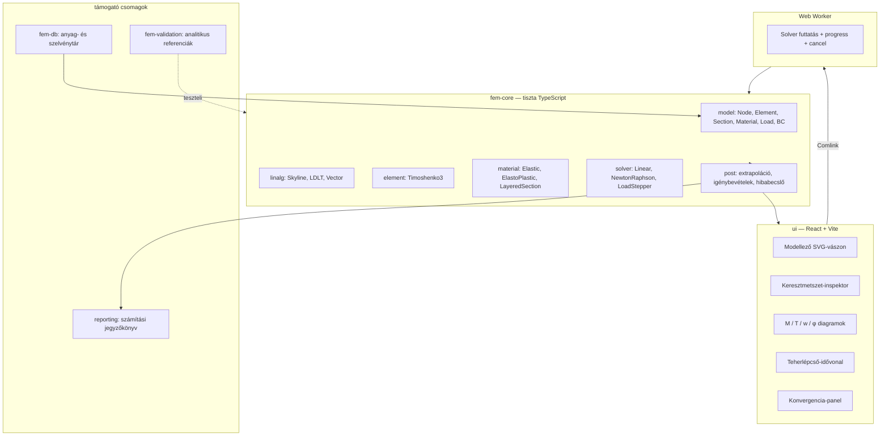
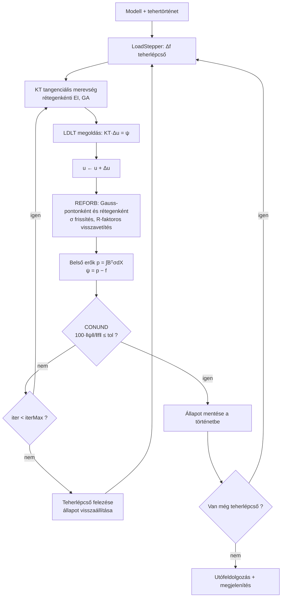

# MASTER PROMPT TERV — `FEMAti`
## Rugalmas–képlékeny Timoshenko gerenda végeselemes analízis — interaktív webalkalmazás

**Forrás:** Bánya Attila: *Rugalmas–képlékeny anyagú gerendaszerkezetek numerikus vizsgálata a végeselemes módszer segítségével*, BME Építőmérnöki Kar, Mechanika Tanszék, 1996. Konzulens: dr. Bojtár Imre.
**Dokumentum célja:** olyan fázisokra bontott, bemásolható prompt-sorozat, amellyel egy AI-asszisztált fejlesztési folyamatban a diplomaterv algoritmusai működő, validált, interaktív VEM szoftverré épülnek.
**Dokumentum verzió:** 1.0 — 2026-08-20
**Szerepkörosztás:** Te = domain-tulajdonos (mechanika, elfogadási kritériumok, validáció). Én = szoftverarchitekt + implementáló.

---

## 0. VEZETŐI ÖSSZEFOGLALÓ

### 0.1 Mit építünk

Egy böngészőben futó, telepítést nem igénylő végeselemes programot, amely a diplomatervben leírt teljes numerikus apparátust implementálja:

| Képesség | Diplomaterv hivatkozás |
|---|---|
| 3-csomópontú izoparametrikus C⁰ Timoshenko gerendaelem, 6 DOF | 3.1.4, 3.1.5 |
| Szelektív redukált integrálás (záródás / shear locking ellen) | 3.1.4 megj., 3.1.5.2 |
| Teherredukció: koncentrált, megoszló (trapéz/parabola), önsúly, hőteher, támaszmozgás, rugalmas ágyazat | 3.1.6, 3.1.7.1 |
| Lineáris megoldás (eredetileg frontális algoritmus) | 3.1.7.3 |
| Feszültség-extrapoláció Gauss-pontból csomópontba + átlagolás | 3.1.7.4 |
| Rugalmas – tökéletesen képlékeny anyagmodell, folyási függvény, keményedés (H′) | 3.2, 3.4.2 |
| Nem-rétegelt (igénybevétel-szintű) képlékeny modell | 3.4.2 |
| **Rétegelt (fiber) Timoshenko gerenda** | 3.4.3 |
| Növekményes Newton–Raphson, reziduális erők, R-faktoros feszültség-visszavetítés | 3.4.4 |
| Konvergencia-kritérium (norma-hányados %-ban) | 3.4.2.1/6, 3.4.3.2/6 |
| Anyag- és szelvényadatbázis | 3.1.6.3.1, 3.1.6.3.2 |
| Tehermentesítés, sajátfeszültségek, beállás | 3.3, 3.3.1 |

### 0.2 Mit ad hozzá a 2026-os kivitel

- **Interaktív modellező** (rajzolás, húzás, azonnali újraszámolás), nem parancsfájl.
- **Teherlépcső-idővonal**: a képlékeny zóna terjedése animálva, léptethetően.
- **Keresztmetszet-inspektor**: bármely Gauss-pontban rétegenkénti σ-profil, M–κ görbe, folyási állapot.
- **Élő konvergencia-diagnosztika**: reziduum-log iterációnként, log-skálán.
- **Automatizált validációs suite**: minden analitikusan zárt megoldás regressziós tesztként fut.
- **Számítási jegyzőkönyv** exportja (HTML/PDF) — mérnökileg felhasználható dokumentáció.
- **Determinisztikus, verziózott modellformátum** (`.femati.json`), Zod-sémával.

### 0.3 Alapelvek (nem tárgyalhatók)

1. **A numerikus mag nem tud a felületről.** `fem-core` nulla UI-függéssel, tisztán, determinisztikusan, Node-ban futtathatóan.
2. **Egyetlen állítás sem kerül be teszt nélkül.** Minden mechanikai képlethez analitikus vagy tanulmányi (konvergencia) ellenőrzés tartozik.
3. **Mértékegység-diszciplína.** A diplomaterv 3. táblázata a szerződés; az átváltás egyetlen modulban él, sehol máshol.
4. **Előjel-konvenció egyszer rögzítve.** Dokumentálva, teszttel őrizve.
5. **Minimalizmus.** Nincs spekulatív absztrakció, nincs „majd jó lesz valamire" réteg. Ami nincs a specben és nincs tesztje, az nem kerül be.

### 0.4 Technológiai döntés és indoklása

| Réteg | Választás | Miért |
|---|---|---|
| Nyelv | TypeScript (strict) | Statikus típusok a mátrixdimenziókra és mértékegységekre; egy nyelv magra és felületre |
| Build | Vite + pnpm workspace | Gyors, monorepo-barát |
| Felület | React 18 + Zustand | Ismert, kis felület, jól tesztelhető állapotkezelés |
| Rajzolás | SVG (modellező) + Canvas2D (eredmény-hőtérkép) | SVG: kattintható entitások; Canvas: sok rétegű kitöltés gyorsan |
| Diagram | saját, D3-scale alapú SVG komponensek | Teljes kontroll M/T/w/φ ábrák mérnöki megjelenése felett |
| Számítás | Web Worker (Comlink) | Az UI sosem fagy; megszakítható futás |
| Teszt | Vitest + fast-check (property alapú) | Numerikus invariánsok tesztelése |
| Séma | Zod | Futásidejű modellvalidáció + típusgenerálás |
| Riport | HTML → `window.print()` / jsPDF | Nincs szerverfüggés |

**Alternatíva, ha desktop kell:** ugyanez a mag Tauri-ban csomagolva (a `fem-core` változatlan). Ha natív numerikus teljesítmény kell nagy modellekre: `fem-core` portolása Rust→WASM, azonos interfésszel — ez a P16 fázis opciója. **A terv úgy készült, hogy ez a döntés később is meghozható legyen.**

---

## 1. A MECHANIKAI SPECIFIKÁCIÓ MAGJA

> Ez a fejezet a szerződés a mag és a valóság között. Minden prompt erre hivatkozik.

### 1.1 Kinematika és előjel-konvenció

Globális rendszer: `x` a rúdtengely mentén jobbra, `z` **lefelé** pozitív, `w` a `z` irányú lehajlás, `φ` a keresztmetszet elfordulása (a diplomaterv 3-1. ábrája szerint).

Timoshenko-feltevés (3.1 egyenlet):

```
γ(x) = φ(x) − ∂w/∂x          nyírási torzulás
κ(x) = ∂φ/∂x                  görbület
```

**Rögzített konvenció:** `γ = φ − dw/dx`. (A K merevségi mátrix invariáns a γ soron végzett globális előjelváltásra, de T és γ előjele nem — ezért kell egyszer rögzíteni és teszttel őrizni.)

Igénybevételek:
```
M = EI · κ
T = GAs · γ,   GAs = κs · G · A,   téglalapra κs = 1/1.2 = 5/6
```

### 1.2 Elem: 3-csomópontú kvadratikus Lagrange, C⁰

Alakfüggvények, ξ ∈ [−1, 1] (3.3 egyenlet):
```
N1(ξ) = ξ(ξ−1)/2      N1' = ξ − 1/2
N2(ξ) = 1 − ξ²        N2' = −2ξ
N3(ξ) = ξ(ξ+1)/2      N3' = ξ + 1/2
```

Jacobi (3.7–3.9):
```
J = dx/dξ = Σ Ni'(ξ) · xi        egyenközű elemnél J = Le/2
dNi/dx = Ni'(ξ) / J
```
**Ellenőrzés:** `|J| > 0` az összes integrálási pontban, különben a leképezés nem megfordítható → hibaüzenet a felhasználónak (degenerált elem).

Elemi szabadságfok-vektor (6 DOF, **rögzített sorrend**):
```
u_e = [ w1, φ1, w2, φ2, w3, φ3 ]ᵀ
```

B mátrix (3.14 egyenlet, a fenti γ-konvencióval):
```
        ⎡  0      dN1/dx    0      dN2/dx    0      dN3/dx ⎤   ← κ sor
B(ξ) =  ⎢                                                   ⎥
        ⎣ −dN1/dx   N1    −dN2/dx    N2    −dN3/dx    N3   ⎦   ← γ sor
```

Anyagmátrix (2.1–2.3):
```
D = diag(EI, GAs)         H = D⁻¹
```

Elemi merevségi mátrix (3.11, 3.24–3.26):
```
Ke = ∫ Bᵀ D B |J| dξ        (ξ szerint, Gauss-kvadratúrával)
```

### 1.3 Szelektív redukált integrálás (a „záródási jelenség" kezelése)

A diplomaterv 3.1.4-ben említett záródás = **shear locking**. Kezelés:

| Tag | Integrálási pontok |
|---|---|
| Hajlítási tag (EI, κ sor) | **3 pont** (teljes): ξ = ∓√0.6, 0; súly 5/9, 8/9, 5/9 |
| Nyírási tag (GAs, γ sor) | **2 pont** (redukált): ξ = ∓1/√3; súly 1, 1 |

Konfigurálhatóan: `integration: 'full' | 'selective'` (alapértelmezés: `selective`). A `full` opció léte nem kényelmi extra — ezzel mutatható meg mérésekkel, hogy a záródás valós, és hogy a redukált séma megszünteti (lásd V-04 validációs eset).

**Mechanizmus-ellenőrzés (3.18, Irons):** `M = d·N − R − r·n`. A magnak elem-szinten ellenőriznie kell, hogy `Ke` rangja = 6 − 2 (két merevtest-mozgás: eltolás + elfordulás). Ha kisebb → hourglass-mód, hiba.

### 1.4 Teherredukció (3.19–3.23)

```
q_e = ∫ Nᵀ p dx  −  ∫ Bᵀ D ε0 dx
```

| Tehertípus | Kezelés |
|---|---|
| Koncentrált csomóponti | közvetlenül a globális vektorba; egy csomópontra egy teher (felülírás) |
| Koncentrált elemen belül | `Nᵀ(ξP) · P`, ξP a támadáspont lokális koordinátája |
| Megoszló, lineáris (trapéz/háromszög) | `∫ Nᵀ q(ξ) |J| dξ`, 3 pontos Gauss |
| Megoszló, parabolikus | ugyanaz, q(ξ) másodfokú interpolációval |
| Megoszló nyomaték m(x) | a φ DOF-okra redukálva |
| **Önsúly** (3.23) | `pz = γsúly · A`, majd mint megoszló teher; automatikusan az anyag- + szelvényadatbázisból |
| **Hőteher** | `ε0 = [κ0, 0]ᵀ`, `κ0 = α · ΔT_grad / h`, ahol `ΔT_grad = T_alsó − T_felső`; egyenletes ΔT-nek nincs hatása tengelyirányú DOF hiányában — ezt a felület **explicit módon közölje**, ne hallgassa el |
| Támaszmozgás | előírt DOF: elimináció, vagy rugós támasznál `k · Δ` hozzáadása a tehervektorhoz (3.1.7.2) |
| Rugalmas ágyazat (3.28) | `Kágy = ∫ Nᵀ c N dx`, c [kN/m/m]; a mag támogassa, a diplomaterv 5. fejezete ezt jelöli meg továbbfejlesztésként |

### 1.5 Peremfeltételek és megoldás

- **Alapértelmezett:** előírt DOF-ok eliminációja (sor/oszlop kivétele, reakció visszaszámolása).
- **Opció:** penalty-módszer nagy rugóállandóval (a diplomaterv 3.1.7.3 szerint ~1e10 kN/m). A két út **azonos eredményt** kell adjon 1e−6 relatív hibán belül — ez teszt.
- **Megoldó (v1):** skyline tárolás + LDLᵀ faktorizáció. `n < 5000` DOF-ra ez bőven elég.
- **Megoldó (opcionális, „történelmi mód"):** frontális algoritmus (3.1.7.3). Nem teljesítményért, hanem mert **a diplomaterv ezt írja le** — didaktikai és hitelességi értéke van, és a frontszélesség vizualizálható. Külön fázis (P17), nem blokkoló.
- Szingularitás-detektálás: ha a faktorizáció során a pivot |d| < ε → „a szerkezet mechanizmus" hibaüzenet, a hiányzó megtámasztásra utaló diagnosztikával.

### 1.6 Utófeldolgozás (3.1.7.4)

1. `ε = B · u_e` a Gauss-pontokban.
2. `σ = D · (ε − ε0)`.
3. Gauss-ponti értékek **extrapolációja** a csomópontokba másodfokú parabolával.
4. Elemhatárokon a két érték **számtani átlaga** (a diplomaterv explicit döntése).
5. Az átlagolás előtti ugrás nagysága = **hibabecslő**; ezt jelenítsük meg (ez modern kiegészítés, a hálósűrítés vezérléséhez).

### 1.7 Rugalmas–képlékeny anyagmodell

**A) Nem-rétegelt (igénybevétel-szintű), 3.4.2**

```
M0 = ∫∫ σ0 z dz dy = σ0 · Kp,   Kp = 2·S0  (képlékeny keresztmetszeti modulus)
f = M² − M0²        f < 0 rugalmas, f = 0 képlékeny
H' = dM/dε(f p) = EI · EI_T / (EI − EI_T)         (3.50)
dM = [EI · EI... ] → dM = (EI · H')/(EI + H') · dκ   tangens hajlítómerevség
dQ = GAs · dγ                                      (nyírás rugalmas marad)
```
Tökéletesen képlékeny eset: `H' = 0` → `EI_T = 0`.

**B) Rétegelt (fiber), 3.4.3 — ez a fő modell**

A keresztmetszet `nL` rétegre bontva (`bl`, `tl`, `zl`):
```
EI = Σ El · bl · zl² · tl                      (3.54)
GA = Σ Gl · bl · tl
M  = Σ σxl · bl · zl · tl                      (3.59)
Q  = Σ τxzl · bl · tl
```
Opció: `includeLayerOwnInertia` — ekkor `EI = Σ El·bl·tl·(zl² + tl²/12)`. Alapértelmezés **ki** (a diplomaterv képlete), de a különbség kimutatandó a rétegszám-konvergencia vizsgálatban.

Rétegenkénti egytengelyű anyagtörvény: lineárisan rugalmas – lineárisan keményedő képlékeny, `σY`, `H'`. `H' = 0` → tökéletesen képlékeny.

**Állapotváltozók** — Gauss-pontonként ÉS rétegenként tárolva, teherlépcsőnként megőrizve:
```
σ, ε, ε_p (képlékeny alakváltozás), ε_p_eff (effektív, halmozott), yielded: boolean
```

### 1.8 Nemlineáris megoldási algoritmus (3.4.2.1, 3.4.3.2, 3.4.4)

```
1) Tehernövekmény:  f ← f + Δf ; i = 0 ; ψ = Δf + ψ_maradék
2) KT tangenciális merevségi mátrix előállítása
3) Δu_i megoldása:  ψ_i = KT · Δu_i
4) u ← u + Δu_i
5) Minden elemre (és rétegre) σ frissítése az anyagtörvény szerint (REFORB);
   belső erők  p(e) = ∫ Bᵀ σ dx  (3 pontos Gauss);
   reziduális erők:  ψ(e) = p(e) − f(e) ; globális kompilálás
6) Konvergencia (CONUND):
        100 · √(Σ ψi²) / √(Σ fi²)  ≤  Tolerancia
7) Ha konvergál → új teherlépcső; különben i ← i+1, ugrás 2)-re
```

**Feszültség-visszavetítés (3.4.4, R-faktor):**

Az `r.` iterációban `σ_re = D·Δε_r` rugalmas próbafeszültség, `σ_re_total = σ_{r−1} + σ_re`.

| Előző állapot | Vizsgálat | Következmény |
|---|---|---|
| Már megfolyt | `σ_re > σ_{r−1}` ? | **Nem** → rugalmas tehermentesítés, ugrás 7. lépésre |
| Már megfolyt | `σ_re > σ_{r−1}` ? | **Igen** → teljes többletet redukálni: **R = 1** |
| Még nem folyt | `σ_re ≥ σY` ? | **Nem** → rugalmas marad, ugrás 7. lépésre |
| Még nem folyt | `σ_re ≥ σY` ? | **Igen** → `R = (σ_re − σY) / (σ_re − σ_{r−1})` |

```
5. lépés:  Δσ_ep = R · Δσ_r · E/(E + H')
           σ_r = σ_{r−1} + (1−R)·Δσ_re + Δσ_ep
6. lépés:  Δε_p = R · Δσ_r / (E · (1 + H'/E))
7. lépés (rugalmas pontok):  σ_r = σ_{r−1} + Δσ_re
8. lépés:  f_R = ∫ Bᵀ σ_r dx    3 pontos Gauss-integrállal
```

**Modern kiegészítések (nem helyettesítik, kiegészítik a fentit):**
- **Adaptív teherlépcső:** ha `iter > iterMax` → lépés felezése és újraindítás; ha `iter < iterMin` néhány lépésen át → lépés növelése (max. `Δf_max`).
- **Módosított Newton–Raphson:** `KT` csak lépésenként egyszer. A diplomaterv lábjegyzete (10. oldal) ezt kifejezetten felveti: *„az iterációnkénti új merevségi mátrix készítése általában több gépidőt vesz igénybe, mintha csak több iterációt hajtanánk végre"* — a szoftver **mérje meg** és mutassa meg mindkettőt. Ez a terv egyik szép momentuma.
- **Ívhossz-vezérlés (Riks) — opcionális, P16:** a teher–elmozdulás görbe csúcsán túli ág követéséhez. A diplomaterv egyparaméteres, teher-vezérelt eljárást ír le; a határteher közelében ez definíció szerint elakad. Világosan jelezzük a felületen, hogy a nem-konvergencia a határteher közelében **fizikai eredmény**, nem hiba.

### 1.9 Mértékegységek (3. táblázat — kötelező)

| Mennyiség | Jel | Egység |
|---|---|---|
| Hossz | L | m |
| Terület | A | cm² |
| Inercia | I | cm⁴ |
| Erő | F, T | kN |
| Nyomaték | M | kNm |
| Megoszló erő | q | kN/m |
| Megoszló nyomaték | m | kNm/m |
| Rugalmassági modulus | E | kN/cm² |
| Nyírási modulus | G | kN/cm² |
| Szög / elfordulás | φ | rad (megjelenítés: ° opcióval) |
| Hőmérséklet | T | °C |
| Sűrűség | ρ | kg/m³ |
| Fajsúly | γ | kN/m³ |
| Hőtágulási együttható | α | 1/°C |
| Eltolódás | e, w | mm |

**Architekturális szabály:** a mag **kizárólag** SI-alapú belső egységekben számol (m, kN, kNm, kN/m²), az átváltás egyetlen `units` modulban történik a be- és kimeneten. Vegyes egységű aritmetika a magban tiltott. A típusrendszer márkázott típusokkal (`Brand<number,'kN'>`) őrizze.

---

## 2. RENDSZERARCHITEKTÚRA



### 2.1 Könyvtárszerkezet

```
femati/
├─ packages/
│  ├─ fem-core/
│  │  ├─ src/
│  │  │  ├─ units/          index.ts, brands.ts
│  │  │  ├─ linalg/         vector.ts, skyline.ts, ldlt.ts, dense.ts
│  │  │  ├─ model/          model.ts, node.ts, element.ts, section.ts,
│  │  │  │                  material.ts, load.ts, boundary.ts, schema.ts
│  │  │  ├─ element/        shapeFunctions.ts, jacobian.ts, bMatrix.ts,
│  │  │  │                  timoshenko3.ts, quadrature.ts
│  │  │  ├─ material/       elastic.ts, elastoPlastic1D.ts,
│  │  │  │                  layeredSection.ts, resultantPlastic.ts
│  │  │  ├─ assembly/       assembler.ts, loadVector.ts, constraints.ts
│  │  │  ├─ solver/         linearSolver.ts, newtonRaphson.ts,
│  │  │  │                  loadStepper.ts, convergence.ts, frontal.ts
│  │  │  ├─ post/           extrapolation.ts, internalForces.ts,
│  │  │  │                  errorEstimator.ts, history.ts
│  │  │  └─ index.ts
│  │  └─ test/
│  ├─ fem-validation/       analytic/*.ts, cases/*.spec.ts, report.ts
│  ├─ fem-db/               materials.json, sections.json, api.ts
│  ├─ reporting/            template.tsx, pdf.ts
│  └─ ui/
│     ├─ src/
│     │  ├─ canvas/         ModelCanvas.tsx, entities/*, interactions/*
│     │  ├─ charts/         DiagramChart.tsx, LoadDisplacement.tsx,
│     │  │                  ConvergenceChart.tsx, SectionStress.tsx
│     │  ├─ panels/         MaterialPanel, SectionPanel, LoadPanel,
│     │  │                  MeshPanel, SolverPanel, ResultsPanel
│     │  ├─ state/          modelStore.ts, resultStore.ts, uiStore.ts
│     │  ├─ worker/         solver.worker.ts, client.ts
│     │  └─ i18n/           hu.ts, en.ts
├─ docs/
│  ├─ THEORY.md             képletek ↔ kód ↔ diplomaterv-oldalszám
│  ├─ VALIDATION.md         validációs jegyzőkönyv (generált)
│  ├─ CONVENTIONS.md        előjelek, DOF-sorrend, egységek
│  └─ ADR/                  architekturális döntések
└─ pnpm-workspace.yaml
```

### 2.2 Megoldási folyamat (nemlineáris)



### 2.3 A diplomaterv modulábrája → mai megfelelők

| Eredeti modul (3.1.7.5 / 3.4.1) | Mai megfelelő |
|---|---|
| `SFR1` (N(ξ) mátrix) | `element/shapeFunctions.ts` |
| `JACOBI` (J, J⁻¹) | `element/jacobian.ts` |
| `MODB` (D mátrix) | `material/*.ts` → `constitutiveMatrix()` |
| `BMATB`, `DBE` | `element/bMatrix.ts` |
| `STIFFB` / `STIFF1..3`, `ASTIF1` | `element/timoshenko3.ts` → `stiffness(mode)` |
| `LOADB` | `assembly/loadVector.ts` |
| `FRONT` / `ASSEMB`+`GREDUC`+`BAKSUB` | `assembly/assembler.ts` + `solver/linearSolver.ts` (+ `frontal.ts`) |
| `STREB` | `post/internalForces.ts` |
| `INITAL`, `INCREM` | `solver/loadStepper.ts` |
| `NONAL` | `solver/newtonRaphson.ts` (algoritmusválasztás) |
| `REFORB` | `material/*.updateState()` + `assembly/internalForceVector.ts` |
| `CONUND` | `solver/convergence.ts` |
| `OUTPUT` | `post/*` + `ui/charts/*` |

**Ezt a táblázatot a `docs/THEORY.md`-be is be kell tenni** — ez teszi a szoftvert a diplomaterv folytatásává, nem pedig egy attól független programmá.

---

## 3. VALIDÁCIÓS TERV

> A „tökéleteshez közeli" nem szándék kérdése, hanem mérésé. Ezek a tesztek CI-ben futnak; egy sem hagyható ki.

### 3.1 Lineáris esetek

| ID | Eset | Analitikus referencia | Tűrés |
|---|---|---|---|
| V-01 | Konzol, végponti P | `w = PL³/(3EI) + PL/(GAs)` | 1e−8 rel. (a kvadratikus elem itt egzakt) |
| V-02 | Kéttámaszú, egyenletes q | `w_max = 5qL⁴/(384EI) + qL²/(8GAs)` | 1e−4, 8 elem |
| V-03 | Tiszta hajlítás patch-test: konstans M | konstans κ, lineáris φ, egzakt | 1e−12 |
| V-04 | **Locking-teszt:** konzol, L/h = 5 / 20 / 100, 1 elem | Timoshenko megoldás | `selective`: hiba < 1 %; `full`: a hiba L/h-val nőjön → **ezt bizonyítja a teszt** |
| V-05 | Merevtest-mozgás: szabad gerenda + eltolás | `Ke·u_rigid = 0` | 1e−12 |
| V-06 | Szimmetria + pozitív definitség | `K = Kᵀ`, minden sajátérték > 0 megtámasztás után | gépi pontosság |
| V-07 | Hőteher: kéttámaszú, ΔT_grad | `w_max = κ0·L²/8`, M = 0 (határozott) | 1e−6 |
| V-08 | Befogott + hőteher | `M = EI·κ0` végig, w = 0 | 1e−6 |
| V-09 | Támaszsüllyedés, kétnyílású | klasszikus erőmódszeres eredmény | 1e−6 |
| V-10 | Önsúly = ekvivalens megoszló teher | két úton azonos | 1e−12 |
| V-11 | Penalty vs. elimináció | azonos u | 1e−6 rel. |
| V-12 | Konvergencia-tanulmány: h-finomítás | a hiba rendje ≈ h³ (elmozdulás) | log–log illesztés meredeksége 2.8–3.2 |

### 3.2 Képlékeny esetek

| ID | Eset | Analitikus referencia | Tűrés |
|---|---|---|---|
| P-01 | Téglalap keresztmetszet, `Mp/Me` | `c = 1.50` (4. táblázat) | 1 % (≥ 20 réteg) |
| P-02 | Kör: `c = 1.70`; körgyűrű: `c = 1.27`; I-szelvény: `1.14–1.16` | 4. táblázat | 2 % |
| P-03 | Konzol, végponti P | `Pu = Mp/L` | 2 % |
| P-04 | Kéttámaszú, középen P | `Pu = 4Mp/L` | 2 % |
| P-05 | Kéttámaszú, egyenletes q | `qu = 8Mp/L²` | 2 % |
| P-06 | Kétoldalt befogott, egyenletes q | `qu = 16Mp/L²` | 3 % |
| P-07 | Kétoldalt befogott, középen P | `Pu = 8Mp/L` | 3 % |
| P-08 | **Kétnyílású folytatólagos, mindkét mezőben q** | `qu = (6 + 4√2)·Mp/L² ≈ 11.657·Mp/L²` | 3 % |
| P-09 | M–κ görbe rétegelt modellel, téglalap | `M/Mp = 1.5·[1 − (1/3)(κe/κ)²]` a rugalmas-képlékeny ágon | 1 % |
| P-10 | **Tehermentesítés → sajátfeszültségek** (3.3) | a maradó feszültség-diagram egyensúlyt tart: `∫σ·z dA = 0`, `∫σ dA = 0` | 1e−6 abszolút |
| P-11 | **Beállás** (3.3): újraterhelés a korábbi M-ig | tisztán rugalmas válasz, nincs új ε_p | ε_p növekmény < 1e−10 |
| P-12 | Keményedés: H' > 0, egytengelyű ellenőrzés | `EI_T = EI·H'/(EI+H')` | 1e−8 |
| P-13 | Rétegszám-konvergencia | 4 → 8 → 16 → 32 → 64 réteg, Mp monoton tart a zárt értékhez | monotonitás + 1 % @64 |
| P-14 | Teherlépcső-függetlenség | 10 vs. 100 lépés → az `u(f)` görbe eltérése | < 1 % |
| P-15 | Newton vs. módosított Newton | azonos végállapot | 1e−6 rel.; iterációszám és futásidő naplózva |
| P-16 | Reziduum monotonitás | teljes Newton mellett kvadratikus konvergencia a képlékeny lépésekben is | reziduum-log ellenőrzése |

### 3.3 A validációs jegyzőkönyv

A `fem-validation` csomag futása **generálja** a `docs/VALIDATION.md` fájlt: minden esetnél a modell, a referenciaérték, a számított érték, az eltérés és a diagram. Ez a dokumentum a szoftver mérnöki hitelesítése — és a diplomaterv 4. fejezetének (Mintafeladatok) mai megfelelője.

---

## 4. FELÜLET- ÉS INTERAKCIÓTERV

### 4.1 Képernyő-felosztás

```
┌────────────────────────────────────────────────────────────────────────┐
│  Fejléc: fájl · anyag · szelvény · háló · megoldó · SZÁMÍTÁS · export  │
├──────────┬─────────────────────────────────────────┬───────────────────┤
│          │                                         │                   │
│  Bal:    │   Középső: MODELL-VÁSZON (SVG)          │  Jobb:            │
│  Modell- │   - gerenda, csomópontok, elemek        │  Eredmény-panel   │
│  fa      │   - támaszok, terhek (húzhatók)         │  - w, φ, M, T     │
│  Adat-   │   - deformált alak (skálázható)         │  - max/min táblák │
│  lapok   │   - képlékeny zónák színezve            │  - reakciók       │
│          │                                         │  - hibabecslő     │
├──────────┴─────────────────────────────────────────┴───────────────────┤
│  Alsó: DIAGRAM-SÁV  [M] [T] [w] [φ] [teher–elmozdulás] [konvergencia]  │
├────────────────────────────────────────────────────────────────────────┤
│  Teherlépcső-idővonal:  ◀ ▮▮▮▮▮▮▮▯▯▯ ▶   λ = 0.72   ▶ lejátszás       │
└────────────────────────────────────────────────────────────────────────┘
```

### 4.2 Kötelező interakciók

1. **Modellépítés**: nyílásméret megadása, támaszok elhelyezése kattintással (görgő/csuklós/befogott/rugós), teher rajzolása húzással.
2. **Élő újraszámolás**: lineáris esetben minden módosítás után (< 50 ms), nemlineáris esetben explicit „Számítás" gombra.
3. **Hálósűrítés csúszkával**, és a hibabecslő azonnal mutatja a hatását.
4. **Teherlépcső-idővonal**: léptetés, lejátszás; a képlékeny zóna terjedése látszik, a teher–elmozdulás görbén pedig a pillanatnyi állapot pontja mozog.
5. **Keresztmetszet-inspektor**: bármely Gauss-pontra kattintva felugró panel a rétegenkénti σ-profillal, a semleges tengely aktuális helyével, a képlékeny/rugalmas zónák megjelölésével, és az adott pont M–κ görbéjével a teljes tehertörténetre. *(Ez a diplomaterv 3-7. ábrájának élő változata — a szoftver leglátványosabb funkciója.)*
6. **Tehermentesítési mód**: a tehertörténet szerkeszthető (fel-le), így a sajátfeszültségek és a beállás jelensége kísérletezhető.
7. **Összehasonlító mód**: rugalmas vs. rugalmas-képlékeny eredmény egymásra vetítve.
8. **Export**: `.femati.json` modell, CSV eredmények, HTML/PDF jegyzőkönyv, SVG diagramok.
9. **Nyelv**: magyar (alapértelmezett) és angol; a mérnöki terminológia a diplomaterv szóhasználatát követi.
10. **Billentyűzet**: teljes navigálhatóság; a vászon aria-leírással.

### 4.3 Megjelenítési szabályok (mérnöki konvenció)

- A **nyomatéki ábra a húzott oldalra** rajzolódik (magyar építőmérnöki konvenció) — kapcsolható.
- A deformált alak külön, túlzó léptékkel; a lépték mindig ki van írva.
- Minden diagramon szerepel a szélsőérték számértéke és helye.
- Színkód: rugalmas = semleges szürke-kék; részben képlékeny = borostyán; teljesen képlékeny = mély vörös. Színvakság-biztos paletta, a szín mellett mindig van mintázat vagy felirat is.

---

## 5. A PROMPT-SOROZAT

> Használat: fázisonként egy prompt, egy futtatás, egy ellenőrzés. **Ne ugorj fázist.** Minden prompt végén ott az elfogadási kritérium — ha nem teljesül, a következő prompt nem indul, hanem a hibát javítjuk.
>
> Minden prompt elé kerüljön ez az állandó fejléc:
>
> **ÁLLANDÓ KONTEXTUS (minden promptban):** *„A `femati` projekten dolgozunk: rugalmas–képlékeny Timoshenko gerenda VEM szoftver, Bánya Attila 1996-os BME diplomaterve alapján. A mechanikai szerződés a `MASTER-PROMPT-TERV.md` 1. fejezete és a `docs/CONVENTIONS.md`. Szigorú TypeScript, `fem-core` nulla UI-függéssel. Minden mechanikai képlethez teszt tartozik. Ne írj spekulatív absztrakciót. Ha egy specifikációs pont ellentmondásos vagy hiányos, ÁLLJ MEG és kérdezz — ne találj ki mechanikát."*

---

### P0 — Alapozás

```
Hozd létre a femati pnpm workspace monorepót az alábbi csomagokkal:
fem-core, fem-validation, fem-db, reporting, ui.

Követelmények:
- TypeScript strict mód: strict, noUncheckedIndexedAccess, exactOptionalPropertyTypes,
  noImplicitOverride mind bekapcsolva.
- Vitest minden csomagban; a fem-core teszt lefedettségi küszöbe 90% (sorok), CI-ben kikényszerítve.
- ESLint + Prettier; tiltott: any, non-null assertion (!), console.log a fem-core-ban.
- A fem-core package.json-ben NE legyen egyetlen UI- vagy DOM-függőség sem;
  ezt egy dependency-guard teszt is ellenőrizze.
- Vite + React 18 az ui csomagban.
- GitHub Actions workflow: typecheck → lint → test → build.
- docs/CONVENTIONS.md kezdőváltozata: DOF-sorrend [w1,φ1,w2,φ2,w3,φ3],
  γ = φ − dw/dx, z lefelé pozitív, belső SI-egységek (m, kN, kNm, kN/m²).
- README.md: mit épít a projekt, honnan származik a specifikáció.

Elfogadás: `pnpm -r test` és `pnpm -r build` hiba nélkül fut egy üres, de valódi
smoke-teszttel minden csomagban.
```

---

### P1 — Domain-modell és séma

```
Implementáld a fem-core/src/model és fem-core/src/units modulokat.

units:
- Márkázott (branded) számtípusok: Meter, Centimeter, KN, KNm, KNPerM, KNPerCm2, Radian, Celsius.
- Konverziós függvények a diplomaterv 3. táblázata szerint (a MASTER-PROMPT-TERV 1.9 pontja).
- A magban minden számítás SI-alapon: m, kN, kNm, kN/m². Az átváltás KIZÁRÓLAG itt.

model:
- Node { id, x }                          — 1D gerenda, x mentén
- Element { id, nodeIds: [n1,n2,n3], sectionId, materialId, integration }
- Material { id, name, E, nu, G (számított vagy megadott), alpha, rho, sigmaY, Hprime }
- Section — diszkriminált unió:
    { kind:'parametric', shape:'rect'|'circle'|'tube'|'i-profile', params, A, I, kappaS }
    { kind:'layered', layers: Layer[] }   Layer { b, t, z, materialId }
- Load — diszkriminált unió:
    NodalForce | NodalMoment | DistributedForce(lineáris|parabolikus, x1..x2)
    | DistributedMoment | SelfWeight | ThermalLoad{ Tref, Ttop, Tbottom }
    | SupportDisplacement { nodeId, dz, dphi }
- Boundary { nodeId, wFixed, phiFixed, springW, springPhi }
- ElasticFoundation { elementId, c }
- LoadCase { id, loads: Load[] }  és  LoadHistory { steps: { lambda }[] }  (egyparaméteres teher)
- Model { nodes, elements, materials, sections, loads, boundaries, foundations, history, meta }

Továbbá:
- Zod-séma a teljes modellre, `.femati.json` v1 formátumhoz, `schemaVersion` mezővel.
- validateModel(model): Diagnostic[] — hibák ÉS figyelmeztetések, mindegyik
  emberi nyelvű magyar üzenettel és a hibás entitás id-jével.
  Kötelező ellenőrzések: kinematikai határozottság (van-e elég megtámasztás),
  elemek folytonossága, középső csomópont az elem belsejében van-e,
  pozitív A és I, sigmaY > 0 ha képlékeny futás kell,
  rétegelt szelvénynél a rétegek hézag- és átfedésmentessége.

Elfogadás: legalább 25 teszt, köztük property-alapú tesztek arra, hogy a
kerek oda-vissza egység-konverzió veszteségmentes, és hogy a szerializálás →
deszerializálás azonos modellt ad.
```

---

### P2 — Lineáris algebra

```
Implementáld a fem-core/src/linalg modult.

- Vector: sűrű, Float64Array alapú; dot, norm2, axpy, scale.
- DenseMatrix: kicsi mátrixokhoz (6×6 elemi), multiply, transpose, rank (SVD vagy QR alapján).
- SkylineMatrix: profil-tárolás; addBlock(dofs, ke) elemi mátrix beszúráshoz.
- LDLT faktorizáció skyline mátrixra + előre/hátra helyettesítés.
  - Pivot-figyelés: ha |d_i| < eps · max|d| → SingularMatrixError, benne az érintett DOF sorszáma.
  - Inerciaszám (negatív pivotok száma) visszaadása — ez később stabilitási diagnosztika.
- reorderCuthillMcKee(): profilcsökkentés, opcionális.

Elfogadás:
- LDLT ellenőrzése ismert kis mátrixokon szimbolikus eredménnyel.
- Property-teszt: véletlen szimmetrikus pozitív definit A és véletlen x esetén
  a megoldás ‖A·solve(A, A·x) − A·x‖ / ‖A·x‖ < 1e−10.
- A skyline és a dense megoldás azonos eredményt ad 1e−12-ig.
- Szinguláris mátrixon SingularMatrixError, nem NaN.
```

---

### P3 — Elem: alakfüggvények, Jacobi, B mátrix, merevség

```
Implementáld a fem-core/src/element modult PONTOSAN a MASTER-PROMPT-TERV 1.2–1.3 pontja szerint.

- shapeFunctions.ts: N1..N3 és deriváltjaik ξ-ben.
- quadrature.ts: Gauss 1, 2, 3 pontos szabályok (ξ, w értékek konstansként, dokumentált forrással).
- jacobian.ts: J(ξ), |J| ellenőrzéssel (J <= 0 → DegenerateElementError).
- bMatrix.ts: B(ξ) a rögzített [w1,φ1,w2,φ2,w3,φ3] DOF-sorrenddel és γ = φ − dw/dx konvencióval.
- timoshenko3.ts:
    stiffness(element, D, mode: 'full' | 'selective'): DenseMatrix (6×6)
    - 'selective': hajlítási tag 3 pont, nyírási tag 2 pont
    - 'full': mindkettő 3 pont
    strains(element, u_e, xi): { kappa, gamma }
    checkMechanisms(ke): rangvizsgálat, elvárt rang = 4 (6 − 2 merevtest-mód)

Elfogadás (kötelező tesztek):
- Alakfüggvény-partíció: ΣNi(ξ) = 1 minden ξ-re (property-teszt).
- Kronecker-tulajdonság: Ni(ξj) = δij.
- Ke szimmetrikus 1e−14-ig.
- Merevtest-mozgásra Ke·u = 0 (eltolás és merev elfordulás egyaránt) 1e−12-ig.
- Ke rangja pontosan 4.
- V-03 patch-test: konstans görbület egzaktul visszakapható.
- Egyenközű csomópontoknál |J| = Le/2 analitikusan.
```

---

### P4 — Kompilálás, peremfeltételek, lineáris megoldás

```
Implementáld az assembly és solver/linearSolver modulokat.

- assembler.ts: globális DOF-térkép (csomópontonként [w, φ]), skyline profil felépítése,
  elemi mátrixok beszúrása, rugalmas ágyazat hozzáadása (∫Nᵀ c N dx).
- constraints.ts: két stratégia — 'elimination' (alapértelmezett) és 'penalty' (k = 1e10 kN/m);
  reakcióerők visszaszámítása mindkét esetben.
- linearSolver.ts: solveLinear(model) → { displacements, reactions, elementStates }.

Kösd be a fem-validation csomagba a V-01, V-03, V-05, V-06, V-11 eseteket
analitikus referenciákkal, a MASTER-PROMPT-TERV 3.1 táblázatának tűréseivel.

Elfogadás: mind az öt validációs eset zölden fut. A reakciók összege
egyensúlyt tart a külső teherrel 1e−10-ig (globális egyensúly-teszt).
```

---

### P5 — Tehervektorok

```
Implementáld az assembly/loadVector.ts modult a MASTER-PROMPT-TERV 1.4 pontja szerint:
koncentrált csomóponti és elemen belüli teher, lineárisan és parabolikusan
megoszló erő, megoszló nyomaték, önsúly (γsúly · A), hőteher (κ0 = α·ΔT_grad/h),
támaszmozgás, mindegyik pontosan a hivatkozott képletekkel.

FONTOS: az egyenletes (gradiens nélküli) ΔT hatása 1D hajlított gerendán,
tengelyirányú szabadságfok hiányában zérus. Ez nem hiba: a validateModel adjon
erre FIGYELMEZTETÉST, ha a felhasználó ilyen terhet ad meg, és a szöveg
magyarázza is meg, miért.

Validáció: V-02, V-07, V-08, V-09, V-10.

Elfogadás: az öt eset zöld. Plusz property-teszt: bármely megoszló teher
csomópontokra redukált vektorának összege egyenlő a teher eredőjével
(erő és nyomaték is), 1e−10-ig.
```

---

### P6 — Utófeldolgozás

```
Implementáld a post modult:
- internalForces.ts: M és T a Gauss-pontokban (σ = D·(ε − ε0)).
- extrapolation.ts: Gauss-ponti értékek másodfokú extrapolációja a csomópontokba;
  elemhatárokon számtani átlagolás (a diplomaterv 3.1.7.4 szerint).
- errorEstimator.ts: az átlagolás ELŐTTI ugrás nagysága elemhatáronként,
  normálva a mező szélsőértékére → százalékos hibajelző elemenként.
- history.ts: teherlépcsőnkénti állapot-pillanatképek tárolása (memória-hatékonyan,
  Float64Array-ekben, nem objektum-tömbökben).

Validáció: V-12 (h-konvergencia tanulmány) — a log–log meredekség automatikus
ellenőrzése, és a mérési pontok kiírása a validációs jegyzőkönyvbe.

Elfogadás: V-12 zöld, az elmozdulás konvergencia-rendje 2.8 és 3.2 között.
```

---

### P7 — Felület: modellező vászon

```
Építsd meg az ui csomag alapját: React + Zustand + SVG modellező vászon.

- modelStore: a fem-core Model típusát tartja, immer-alapú módosításokkal, undo/redo-val.
- ModelCanvas: gerenda, csomópontok, elemhatárok, támaszjelek (görgős, csuklós,
  befogott, rugós), teherjelek (nyíl, megoszló ábra, hőteher jelölés).
- Interakciók: támasz elhelyezése/áthúzása, teher rajzolása húzással, entitás
  kijelölése és szerkesztése a jobb oldali adatlapon, zoom/pan.
- Automatikus hálógenerálás: n elem egyenközűen, csúszkával állítva; a középső
  csomópontok automatikusan a felezőpontba.
- Lineáris megoldás azonnal fut minden változtatás után (< 50 ms modellméretig
  szinkron, felette Web Workerben).
- Teljes billentyűzetes elérhetőség, aria-címkék, magyar felirat (i18n előkészítve).

Elfogadás: kézi átvétel a V-01 és V-02 esetek felrajzolásával; az eredmény
számértékben egyezik a fem-validation által számítottal. A vászon 1000 elemnél
is 60 fps-sel pan/zoomolható.
```

---

### P8 — Diagramok

```
Implementáld az ui/charts komponenseket: M, T, w, φ ábrák.

- Közös tengely- és léptékkezelés, összehangolt hover (egy helyen mozgatva az
  egeret mind a négy ábrán megjelenik a metszet értéke).
- A nyomatéki ábra a húzott oldalra rajzolódik (kapcsolható konvenció).
- Szélsőértékek automatikus felirata (érték + hely).
- Deformált alak külön rétegként a modellvásznon, kiírt túlzási léptékkel.
- Hibabecslő megjelenítése: az elemhatárokon lévő ugrás színkóddal az elemsávon.
- SVG export egyenként és összesítve.

Elfogadás: a V-02 eset ábrái vizuálisan és számszerűen helyesek; a hover
minden ábrán ugyanazt az x-metszetet mutatja; a diagramok sötét és világos
témában egyaránt olvashatók.
```

---

### P9 — Rugalmas–képlékeny anyagmodell: nem-rétegelt (igénybevétel-szintű)

```
Implementáld a material/resultantPlastic.ts modult a MASTER-PROMPT-TERV 1.7/A pontja szerint.

- M0 = σ0 · Kp számítása a parametrikus szelvényekre (Kp = 2·S0);
  a rect / circle / tube / i-profile esetekre zárt képletekkel.
- Folyási függvény f = M² − M0².
- H' lineáris keményedési paraméter és EI_T = EI·H'/(EI + H') kapcsolat.
- updateState(state, dKappa, dGamma): a nyírás rugalmas marad (dQ = GAs·dγ),
  a hajlítás követi a képlékeny törvényt.
- A tangenciális D mátrix előállítása.

Validáció: P-01, P-02 (Me/Mp arányok a 4. táblázat szerint), P-12.

Elfogadás: a c = Mp/Me arányok a 4. táblázat értékeire állnak be a megadott
tűrésen belül. Egytengelyű terhelés–tehermentesítés ciklus M–κ görbéje
pontosan a lineárisan rugalmas – tökéletesen képlékeny alakot adja H' = 0-nál.
```

---

### P10 — Rétegelt (fiber) keresztmetszet

```
Implementáld a material/layeredSection.ts és material/elastoPlastic1D.ts modulokat
a MASTER-PROMPT-TERV 1.7/B pontja szerint.

- Rétegzés generálása parametrikus szelvényből (rect, circle, tube, I) adott
  rétegszámmal; a rétegszélesség b(z) a valós kontúrból.
- EI = Σ El·bl·zl²·tl és GA = Σ Gl·bl·tl (3.54);
  opció: includeLayerOwnInertia (alapértelmezés: ki).
- M = Σ σxl·bl·zl·tl és Q = Σ τxzl·bl·tl (3.59).
- Rétegenkénti állapot: σ, ε, ε_p, ε_p_eff, yielded.
- elastoPlastic1D: egytengelyű lineárisan rugalmas – lineárisan keményedő modell,
  a 3.4.4 szerinti R-faktoros feszültség-visszavetítéssel, PONTOSAN a
  MASTER-PROMPT-TERV 1.8 pontjának döntési táblázata szerint (a négy eset:
  már megfolyt + terhelés / már megfolyt + tehermentesítés / még nem folyt +
  most megfolyik / még nem folyt + rugalmas marad).

Validáció: P-09 (M–κ görbe zárt megoldással), P-13 (rétegszám-konvergencia).

Elfogadás: P-09 1%-on belül; P-13-ban Mp monoton tart a zárt értékhez, 64 rétegnél
1%-on belül. A semleges tengely elmozdulása aszimmetrikus szelvénynél kimutatható
és helyes.
```

---

### P11 — Nemlineáris megoldó

```
Implementáld a solver/newtonRaphson.ts, loadStepper.ts, convergence.ts modulokat
a MASTER-PROMPT-TERV 1.8 pontjának 7 lépéses algoritmusa szerint (a diplomaterv
3.4.2.1 / 3.4.3.2 / 3.4.4 pontjai).

Kötelező elemek:
- Tangenciális KT elemenként és Gauss-pontonként (rétegelt esetben rétegenként).
- Belső erővektor p = ∫Bᵀσ dx, 3 pontos Gauss-integrállal (3.60).
- Reziduális vektor ψ = p − f, globális kompilálás.
- Konvergencia PONTOSAN: 100·√(Σψi²)/√(Σfi²) ≤ tolerancia (alapértelmezés 1%).
- Algoritmusválasztás (a NONAL modul mai megfelelője):
    'newton' (KT minden iterációban) | 'modified-newton' (KT lépésenként egyszer)
    | 'initial-stiffness' (K0 végig).
- Adaptív teherlépcső: iterMax túllépésekor felezés + állapot-visszaállítás,
  iterMin alatt növelés Δf_max-ig. A visszaállításnak TELJESNEK kell lennie:
  minden Gauss-pont minden rétegének állapota.
- Iterációs napló: lépésenként és iterációnként reziduum-norma, futásidő,
  megfolyt Gauss-pontok száma.
- Megszakíthatóság (AbortSignal) és haladásjelzés.

Elfogadás: P-14 (teherlépcső-függetlenség), P-15 (Newton vs. módosított Newton),
P-16 (reziduum-monotonitás). A napló mutassa, hogy teljes Newton mellett a
reziduum kvadratikusan csökken.

FIGYELEM: a határteher közelében a teher-vezérelt eljárás DIVERGÁL — ez fizikai
eredmény, nem szoftverhiba. A megoldó ezt külön státusszal jelezze
('limit-load-reached'), ne általános hibaként.
```

---

### P12 — Képlékeny validációs suite

```
Implementáld a fem-validation csomagban a P-03 … P-08, P-10, P-11 eseteket.

Minden esetnél:
- a modell programozottan felépítve,
- az analitikus referencia külön modulban, levezetéssel kommentben,
- a számított határteher meghatározása: az utolsó konvergált teherlépcső,
  illetve a teher–elmozdulás görbe vízszintes érintőjének megkeresése,
- eltérés kiírása.

Kiemelt eset — P-08: kétnyílású folytatólagos gerenda, mindkét mezőben egyenletes q.
Referencia: qu = (6 + 4√2)·Mp/L² ≈ 11.657·Mp/L². Ez a diplomaterv fő feladattípusa,
ezért ehhez készüljön külön részletes jegyzőkönyv-fejezet: a képlékeny csuklók
kialakulásának sorrendje, a nyomatéki ábra átrendeződése lépésről lépésre.

P-10 (sajátfeszültségek) és P-11 (beállás): a tehertörténet fel-le vezetése,
majd az egyensúlyi integrálok ellenőrzése és az újraterhelés rugalmasságának
bizonyítása.

Elfogadás: minden eset zöld a megadott tűréssel. A generált docs/VALIDATION.md
tartalmazza az összes esetet táblázatosan és ábrákkal.
```

---

### P13 — Interaktív képlékeny megjelenítés

```
Építsd meg a nemlineáris eredmények megjelenítését:

1. Teherlépcső-idővonal: léptetés, lejátszás, sebességszabályzó; az idővonalon
   jelölve, hol folyt meg először egy Gauss-pont, és hol alakult ki képlékeny csukló.
2. Képlékeny zónák a modellvásznon: elemenként és a keresztmetszet magassága
   mentén is (a rétegelt modell adataiból), színkóddal + mintázattal.
3. Teher–elmozdulás görbe: a pillanatnyi állapot pontja mozog az idővonallal;
   a rugalmas egyenes referenciaként bejelölve; a határteher vízszintes aszimptotája.
4. KERESZTMETSZET-INSPEKTOR (a legfontosabb funkció): bármely Gauss-pontra
   kattintva panel nyílik, benne
   - a rétegenkénti σ-profil oszlopdiagramja a keresztmetszet magassága mentén,
   - a semleges tengely aktuális helye,
   - a rugalmas / képlékeny zónák határa,
   - az adott pont M–κ görbéje a teljes tehertörténetre, a pillanatnyi állapottal,
   - tehermentesítés után a maradó (saját)feszültségek külön rétegként.
   Ez a diplomaterv 3-7. ábrájának élő, interaktív megfelelője.
5. Konvergencia-panel: iterációnkénti reziduum log-skálán, lépésenként csoportosítva;
   látszódjon, ha a megoldó felezte a teherlépcsőt.

Elfogadás: a P-08 eset végigjátszható; az inspektor a támasz feletti keresztmetszetben
helyesen mutatja a képlékeny csukló kialakulását; a tehermentesítés utáni
maradó feszültségek egyensúlyt tartanak (a panel ezt ki is írja).
```

---

### P14 — Anyag- és szelvényadatbázis

```
Implementáld a fem-db csomagot a diplomaterv 3.1.6.3.1 és 3.1.6.3.2 pontja szerint.

- materials.json: acél (S235, S275, S355), beton (C16/20 … C50/60), fa (C24, GL24h),
  alumínium. Mezők: E [kN/cm²], ν, α [1/°C], ρ [kg/m³], σY [kN/cm²] ahol értelmezett.
- sections.json: melegen hengerelt acél szelvények (IPE, HEA, HEB, U), téglalap és
  kör beton keresztmetszetek paraméteresen.
- Minden rekordhoz KÖTELEZŐ a `source` mező (szabvány- vagy irodalmi hivatkozás)
  és a `verified: boolean` mező.
- A felületen ott a diplomaterv figyelmeztetése szó szerint: az adatbázis értékei
  tájékoztató jellegűek, az első felhasználás előtt ellenőrizni kell.
- Fa esetén: légszáraz (12% nedvesség) testsűrűség, hajlításvizsgálatból származó E,
  a lassú alakváltozás NINCS figyelembe véve — ez jelenjen meg a felületen is.
- Beton esetén: E a tartós terhekhez tartozó érték (Ebt) — szintén jelezve.
- Automatikus önsúly-generálás anyag + szelvény alapján, kapcsolható.

Elfogadás: az adatok mintavételes ellenőrzése szabvány szerint (legalább 5 szelvény
kézi ellenőrzése A és I értékére). A `verified: false` rekordokat a felület
külön megjelöli.
```

---

### P15 — Számítási jegyzőkönyv

```
Implementáld a reporting csomagot: nyomtatható HTML → PDF számítási jegyzőkönyv.

Tartalom:
1. Fejléc: projekt, dátum, a szoftver verziója és a mag commit-hash-e.
2. Modell: geometria, anyagok, szelvények, terhek, peremfeltételek — táblázatosan és ábrán.
3. Háló: elemszám, elemméretek, integrálási séma.
4. Megoldó beállításai: algoritmus, teherlépcsők, tolerancia.
5. Eredmények: M, T, w, φ ábrák, szélsőértékek, reakciók, egyensúly-ellenőrzés.
6. Nemlineáris futásnál: teher–elmozdulás görbe, a képlékeny csuklók kialakulási
   sorrendje, a határteher, a konvergencia-napló összefoglalója.
7. Hibabecslés és hálófüggetlenségi megjegyzés.
8. Lábléc minden oldalon: "A számítás eredményét szakmai felelősséggel ellenőrizni kell."

Az elméleti háttér hivatkozásai a docs/THEORY.md-re mutassanak, az pedig a
diplomaterv oldalszámaira.

Elfogadás: a P-08 esetre generált jegyzőkönyv A4-en helyesen tördelt, minden ábra
vektoros, a számértékek egyeznek a felületen látottakkal.
```

---

### P16 — Teljesítmény, robusztusság, opcionális bővítések

```
1. Profilozás: 5000 DOF-os modell, 100 teherlépcső, rétegelt szelvény 32 réteggel.
   Célszám: teljes futás < 10 s asztali gépen; ha nem teljesül, a szűk keresztmetszet
   MÉRÉSSEL azonosítva, nem találgatással.
2. Optimalizálás sorrendben: (a) allokációk kiiktatása a belső ciklusokból
   (előre foglalt Float64Array pufferek), (b) Cuthill–McKee átrendezés,
   (c) csak ezután merüljön fel a WASM. A WASM-döntést külön ADR rögzítse.
3. Robusztusság: hibás modelleken (mechanizmus, nulla merevség, degenerált elem,
   negatív rétegvastagság) mindenhol értelmes magyar hibaüzenet, sehol NaN, sehol néma hiba.
4. Fuzz-teszt: véletlen érvényes modellek generálása, a megoldó nem dobhat
   kezeletlen kivételt, és a globális egyensúlynak mindig teljesülnie kell.
5. OPCIONÁLIS, csak ha a fentiek készen vannak: ívhossz-vezérlés (Riks) a
   teher–elmozdulás görbe csúcson túli ágának követéséhez, külön kapcsolóval,
   világosan megkülönböztetve a diplomaterv eredeti teher-vezérelt eljárásától.

Elfogadás: a célszám teljesül vagy a hiánya mérési adatokkal indokolt;
a fuzz-teszt 10 000 véletlen modellen hibátlanul fut.
```

---

### P17 — „Történelmi mód": frontális megoldó

```
Implementáld a solver/frontal.ts modult: a diplomaterv 3.1.7.3 pontjában leírt
frontális algoritmust, ahol a kompilálás és az elimináció NEM válik szét, és a
front szélessége az elemsorszámozástól függ.

Cél: nem teljesítmény, hanem hitelesség és didaktika.

- Az eredménynek 1e−10 relatív pontossággal egyeznie kell a skyline-LDLT eredményével
  (ez a teszt).
- A felületen külön nézet: a front kialakulása és mozgása animálva, a pillanatnyi
  frontszélesség kiírva, összevetve a skyline-profil méretével.
- Rövid magyarázó szöveg: miért volt ez 1996-ban a helyes választás, és mi változott azóta.

Elfogadás: a numerikus egyezés-teszt zöld; az animáció a V-02 modellen érthetően
mutatja a front mozgását.
```

---

### P18 — Dokumentáció és lezárás

```
1. docs/THEORY.md: minden implementált képlet, mellette a kód helye
   (fájl:függvény) ÉS a diplomaterv oldalszáma. A MASTER-PROMPT-TERV 2.3
   moduláris megfeleltetési táblázata is ide kerül.
2. docs/CONVENTIONS.md véglegesítése: előjelek, DOF-sorrend, egységek,
   integrálási sémák, mindegyikhez a rá vonatkozó teszt hivatkozásával.
3. docs/VALIDATION.md: a validációs futás által GENERÁLT dokumentum,
   nem kézzel írott.
4. docs/ADR/: legalább az alábbi döntések rögzítve — TypeScript vs. Rust/WASM;
   skyline vs. frontális; elimináció vs. penalty; rétegelt vs. igénybevétel-szintű
   képlékenység; teher-vezérelt vs. ívhossz.
5. README: rövid bemutatás, képernyőképek, a diplomaterv és a szoftver kapcsolata,
   futtatási útmutató.
6. Beépített „Elmélet" nézet a felületen: a fenti dokumentumok olvashatók az appban,
   a képletek KaTeX-szel szedve.

Elfogadás: egy kívülálló mérnök a dokumentációból meg tudja állapítani, hogy melyik
képlet hol van implementálva, és hogy azt mi bizonyítja.
```

---

## 6. DEFINITION OF DONE

Egy fázis akkor kész, ha **mind a hét** teljesül:

1. A fázis elfogadási kritériuma teljesül, mérhetően.
2. Minden új mechanikai képlethez tartozik teszt, és a teszt **elbukik**, ha a képletet szándékosan elrontjuk (mutációs próba legalább egy képletre fázisonként).
3. `pnpm -r typecheck && pnpm -r lint && pnpm -r test` tisztán fut.
4. A `fem-core` lefedettsége ≥ 90 %.
5. A `docs/THEORY.md` frissült az új képletekkel és oldalszám-hivatkozásokkal.
6. Nincs `TODO`, `FIXME`, `any`, kikapcsolt teszt.
7. A felületi részeknél: billentyűzettel használható, sötét és világos témában olvasható.

---

## 7. KOCKÁZATOK ÉS ELŐRE ELDÖNTÖTT VÁLASZOK

| # | Kockázat | Válasz |
|---|---|---|
| K1 | **Shear locking** karcsú gerendáknál | Szelektív redukált integrálás alapértelmezésként; a V-04 teszt mindkét sémát méri és bizonyítja a különbséget |
| K2 | **Hourglass mód** a redukált integrálás miatt | Irons-féle mechanizmus-ellenőrzés (3.18) minden elemtípusra, elemenként, a rangvizsgálattal |
| K3 | **Előjel-káosz** (γ, M, T, z lefelé) | Egyszer rögzítve a `CONVENTIONS.md`-ben, teszttel őrizve, a felületen kapcsolható megjelenítési konvenció — de a mag konvenciója soha nem változik |
| K4 | **Egység-hibák** (cm² vs. m², kN/cm² vs. kN/m²) | Márkázott típusok + egyetlen konverziós modul + property-tesztek; a mag SI-ben számol |
| K5 | **Divergencia a határteher közelében** | Nem hiba, hanem eredmény: külön státusz, adaptív lépésfelezés, opcionális ívhossz-vezérlés (P16) |
| K6 | **Teherlépcső-függőség** | P-14 teszt; a felület figyelmeztet, ha a lépések száma túl kicsi a képlékeny zóna méretéhez képest |
| K7 | **Rétegszám-érzékenység** | P-13 konvergencia-teszt; ajánlott minimum (20 réteg) a felületen javasolva, indoklással |
| K8 | **A régi diplomaterv képletei helyenként tömörek vagy sajtóhibásak** | Ha egy képlet ellentmondásos, a prompt-fejléc utasítása lép életbe: **megállunk és kérdezünk**, nem találunk ki mechanikát. Minden ilyen eset az ADR-ekben rögzítve, a döntés indoklásával |
| K9 | **Scope-csúszás** (héjelemek, 2D, dinamika) | A terv 1D gerendára szól. Bővítés csak akkor, ha az összes validációs eset zöld, és külön ADR dönt róla |
| K10 | **A UI elviszi a fókuszt a magról** | A P0–P6 fázis kizárólag mag; az első felületi elem csak validált lineáris mag után jön |

---

## 8. ÜTEMEZÉSI JAVASLAT

| Szakasz | Fázisok | Eredmény |
|---|---|---|
| **I. Mag — lineáris** | P0 – P6 | Fejlesztői konzolról futtatható, validált lineáris Timoshenko VEM |
| **II. Felület — lineáris** | P7 – P8 | Használható interaktív program rugalmas számításra |
| **III. Mag — képlékeny** | P9 – P12 | Validált rugalmas-képlékeny mag, rétegelt keresztmetszettel |
| **IV. Felület — képlékeny** | P13 | A diplomaterv élő, interaktív megfelelője |
| **V. Mérnöki kiegészítők** | P14 – P15 | Adatbázisok, számítási jegyzőkönyv |
| **VI. Finomítás** | P16 – P18 | Teljesítmény, frontális mód, dokumentáció |

Az I. és III. szakasz a projekt kritikus útja. A II. és IV. szakasz látványos, de nem szabad előrehozni: felület validálatlan mag fölé építve téves eredményeket mutat meggyőző formában — ez a lehető legrosszabb kimenetel egy statikai programnál.

---

## 9. MI TESZI EZT TÖBBÉ EGY GYAKORLÓFELADATNÁL

A diplomaterv 5. fejezete három továbbfejlesztési irányt nevez meg. Ezek közül:

- **Winkler-féle rugalmas ágyazat rétegelt gerendáknál** — a terv már tartalmazza (1.4, `ElasticFoundation`), a P4 fázisban implementálva. Ez a diplomaterv egyik nyitott kérdésének lezárása.
- **Viszkózus anyagi tulajdonságok** — nincs a hatókörben, de az anyagmodell interfésze (`updateState`) úgy van kialakítva, hogy időfüggő modell később, a mag többi részének érintése nélkül beilleszthető legyen.
- **Többparaméteres teher** — a `LoadHistory` egyparaméteres, de a `LoadCase` szerkezete megengedi a bővítést. Külön ADR döntsön róla, ha aktuálissá válik.

Vagyis: harminc év után az egyik nyitott kérdés lezárul, a másik kettőhöz pedig nyitva marad az ajtó — anélkül, hogy ma spekulatív kódot írnánk rájuk.

---

*Készült: 2026-08-20. A dokumentum a `Q:\Projects\diplomaterv-bme\Diplomaterv (BME).pdf` (73 oldal) teljes átolvasása alapján készült.*
