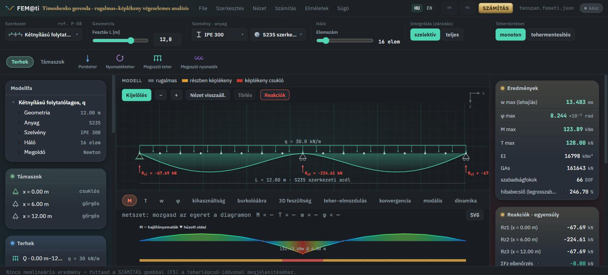
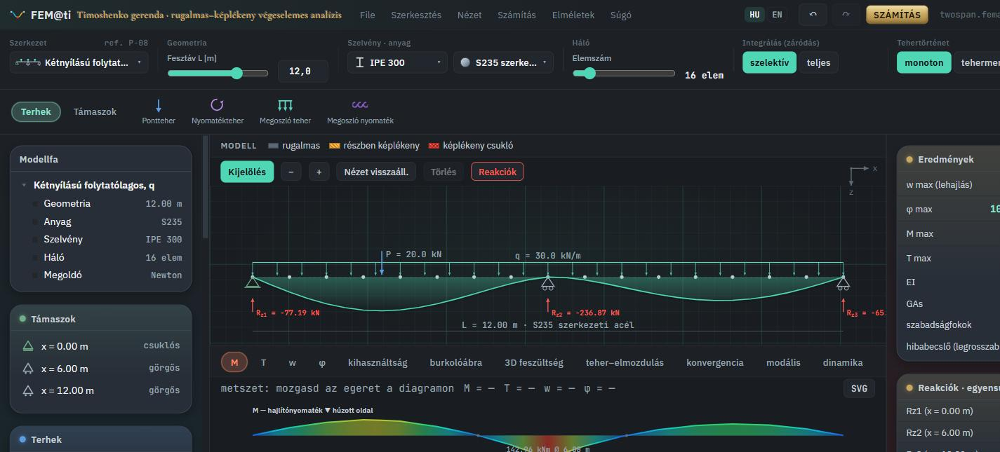
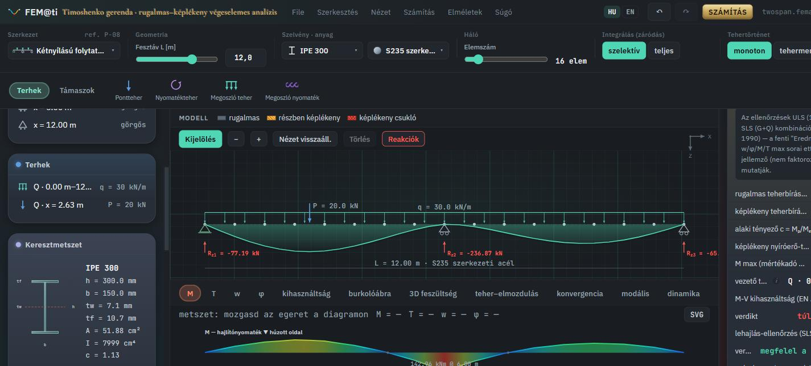
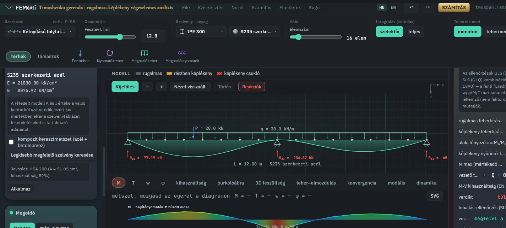

# FEM@ti — Quick Start

*[Magyarul](QUICKSTART.hu.md)*

This is a short, targeted walkthrough — not a full reference manual. It
shows how to carry the simplest design task through the workspace: build a
model → add a load → read the results → get a section suggestion. Each
section links to the deeper documents (mechanical derivation, validation,
limitations) for anyone who wants more.

---

## 1. The workspace

On startup the app opens with a preset structural scheme (left panel:
**Szerkezet**/Structure, **Geometria**/Geometry, **Szelvény ·
anyag**/Section & material, **Háló**/Mesh). The center canvas shows the
beam and the active internal-force diagram (M/T/w/φ); the right panel
shows the **Eredmények**/Results card.

- **Szerkezet** (Structure) dropdown: ready-made structural-scheme
  presets (simple two-support, cantilever, continuous, etc.) — this sets
  the supports and a starting load.
- **Geometria** (Geometry): span length (slider or a typed exact value).
- **Szelvény · anyag** (Section & material): pick a cross-section (I, U,
  RHS, circle, tube, rectangle, T) and a material (steel/concrete) from
  the catalog, with a full data sheet (click the name).
- **Háló** (Mesh): element count — the default is fine for most practical
  cases.

## 2. Adding a load

The "Terhek" (Loads) tab on the left offers four load types: **point
force**, **point moment**, **distributed load**, **distributed moment**.
Click the icon you want, then click the beam on the canvas where the load
should act — it appears immediately, and every diagram/result
recomputes.

The new load also shows up in the "Terhek" list on the left, where you can
type an exact value (position, magnitude); the **G**/**Q** tag marks its
category (permanent/variable — this matters for the load combination, see
step 3).

## 3. Reading the results

The right panel's **Eredmények** (Results) card shows the headline
quantities (w max, φ max, M max, T max, EI, GAs) for the *characteristic*
(unfactored) load — this answers "what did I type in." For design, the
**Határteher-ellenőrzés** (Ultimate-capacity check) card further down is
the one that matters, because it runs on the actual design (ULS/SLS) load
combination:

- **M-V kihasználtság** (M-V utilization, EN 1993-1-1) — the utilization
  percentage from the moment-shear interaction, with a green/red verdict.
- **lehajlás-ellenőrzés** (deflection check, SLS, L/250) — separately, on
  the unfactored (G+Q) combination.
- **M max (mértékadó ULS-kombináció)** (governing ULS combination) and
  **vezető teher (ULS)** (leading load) — if the model has 2+ simultaneous
  variable loads, this shows which one the program took as "leading" (EN
  1990 6.10, ψ₀=0.7) for the governing result.

For the exact formulas behind these utilization percentages, and an
honest list of what is *not* claimed, see
[`docs/VALIDATION-SCOPE.md`](VALIDATION-SCOPE.md).

## 4. Section optimization

If the check above is red ("exceeds the limit"), the left panel's
**"Legkisebb megfelelő szelvény keresése"** (Find the smallest suitable
section) button runs through the catalog family of the same section type,
sorted by area, and suggests the first one that passes:

The **Alkalmaz** (Apply) button switches to the suggested section in one
click. Note: it only changes the section — not the material, span, loads,
or reinforcement, and the rebar amount stays fixed across every candidate
section (see the warning text next to the button).

## 5. Going further

- **Nonlinear (elastic–plastic) run** — the **SZÁMÍTÁS** (Compute) button
  at the top (or F5) runs the full load-stepped, plastic-hinge analysis
  with the layered cross-section model; the "kihasználtság"/"burkolóábra"
  tabs and the cross-section inspector belong to this.
- **Full derivation and report** — an editable Word (.docx) and printable
  PDF export covering every Gauss point and the layered return-mapping.
- **"Elméletek" (Theories) menu / Help** — the same mechanical derivation,
  typeset with KaTeX, right inside the app, with page and equation
  references back to the original thesis
  ([`docs/THEORY.md`](THEORY.md)).
- **What is not claimed** —
  [`docs/VALIDATION-SCOPE.md`](VALIDATION-SCOPE.md) honestly lists the
  modeling simplifications and the scope of validation.

---

*The screenshots are from a live run on a two-span continuous beam
(IPE 300, S235, q=30 kN/m + a P=20 kN point load).*
